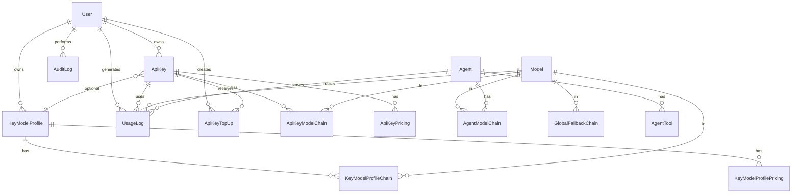

# AI Gateway Platform — документация проекта

**Production:** [https://crm-al.neeklo.ru/](https://crm-al.neeklo.ru/)  
**Сервер:** `/var/www/crm-al-tokens`  
**API prefix:** `/api`

---

## Содержание

1. [О проекте](#1-о-проекте)
2. [Архитектура и стек](#2-архитектура-и-стек)
3. [Роли и доступ](#3-роли-и-доступ)
4. [Основная функциональность](#4-основная-функциональность)
5. [Панель управления (все разделы)](#5-панель-управления-все-разделы)
6. [Админ-панель (все разделы)](#6-админ-панель-все-разделы)
7. [Справочник API](#7-справочник-api)
8. [База данных](#8-база-данных)
9. [Деплой и инфраструктура](#9-деплой-и-инфраструктура)

---

## 1. О проекте

**AI Gateway Platform** — SaaS-платформа для выпуска и управления API-ключами доступа к AI-моделям и AI-агентам через единый шлюз [OpenRouter](https://openrouter.ai).

### Назначение

Платформа решает задачи:

- **Единая точка доступа** к сотням LLM через OpenRouter с форматом OpenAI-compatible API.
- **Биллинг в рублях** — баланс на каждом API-ключе, списание за токены по настраиваемым тарифам.
- **Профили маршрутизации** (`auto`, `aura`, `neeklo`) — цепочки моделей с fallback и фиксированной ценой за 1M токенов.
- **AI-агенты** — готовые роли (Юрист, Маркетолог, Копирайтер и др.) с системными промптами.
- **Аналитика и аудит** — учёт каждого запроса, себестоимость, маржа, история пополнений.
- **Мультитенантность** — пользователи, роли, изоляция ключей и профилей.

### Ключевые возможности

| Возможность | Описание |
|-------------|----------|
| API Gateway | `POST /api/v1/chat/completions` — прокси в OpenRouter с fallback |
| Агенты | `POST /api/v1/agents/:id/chat` — чат с преднастроенным system prompt |
| Профили моделей | `auto` / `aura` / `neeklo` — выбор через параметр `model` в запросе |
| Баланс ключей | Пополнение в ₽, проверка перед запросом, ответ **402** при нулевом остатке |
| Кастомные цепочки | На уровне ключа или профиля — приоритетные модели |
| Каталог моделей | Синхронизация с OpenRouter, лейблы (FREE, CHEAP, FAST, PREMIUM…) |
| 2FA | TOTP для аккаунтов |
| Command Palette | `Ctrl+K` в интерфейсе |
| Темы | Светлая / тёмная / системная |

### Бизнес-модель (тарификация)

- **Себестоимость** — цены OpenRouter (input/output за 1M токенов).
- **Продажная цена** — задаётся в профиле (`pricePerMillionRub`) или per-model в pricing.
- **Маржа** = `userCost - realCost` — видна администратору в Dashboard и Аналитике.

Типовые профили (пример):

| Slug (`model`) | Цена / 1M токенов | Назначение |
|----------------|-------------------|------------|
| `auto` | ~2000 ₽ | Бесплатные языковые модели + 2 дешёвых платных |
| `aura` | ~3000 ₽ | Документы, OCR, длинный контекст |
| `neeklo` | ~8000 ₽ | Платные модели среднего уровня |

---

## 2. Архитектура и стек

```
apps/
  api/     — NestJS backend (порт 3075 на prod)
  web/     — React + Vite frontend (статика в apps/web/dist)
deploy/    — nginx, PM2, скрипты деплоя
```

| Слой | Технологии |
|------|------------|
| Frontend | React, Vite, TypeScript, TailwindCSS, shadcn/ui, React Query, Zustand, Recharts |
| Backend | NestJS, Prisma, PostgreSQL, Redis, BullMQ (заготовка) |
| AI Provider | OpenRouter API |
| Production | Nginx → static + proxy `/api/` → PM2 `crm-al-tokens-api` |
| БД / кэш | Docker: `crm-al-tokens-postgres` (15433), `crm-al-tokens-redis` (16380) |

### Поток запроса через Gateway

```
Клиент (Bearer agw_...)
    → Nginx /api/v1/chat/completions
    → GatewayService
        1. Валидация API-ключа (статус, IP)
        2. Проверка баланса (402 если исчерпан)
        3. Выбор профиля/цепочки моделей (model → auto/aura/neeklo)
        4. Вызов OpenRouter (с fallback по цепочке)
        5. Расчёт стоимости, запись UsageLog, списание spentRub
    → OpenAI-compatible JSON response
```

---

## 3. Роли и доступ

### Роли (`UserRole`)

| Роль | Описание |
|------|----------|
| `USER` | Свои API-ключи, профили, аналитика по своим данным |
| `DEVELOPER` | Расширенный доступ (как USER; роль зарезервирована) |
| `ADMIN` | Полный доступ: пользователи, аудит, маржа, все ключи, admin API |

### Типы авторизации API

| Тип | Заголовок | Где используется |
|-----|-----------|------------------|
| JWT | `Authorization: Bearer <token>` | Панель, CRUD, аналитика |
| API Key | `Authorization: Bearer agw_...` | Gateway, v1/usage, v1/balance, v1/models |

Публичные маршруты (`@Public()`): login, gateway chat, v1 endpoints с ApiKeyOrJwtGuard.

---

## 4. Основная функциональность

### 4.1 API-ключи

- Формат ключа: `agw_<random>` (префикс `agw_`).
- Хранение: hash + опционально encrypted (для «показать ключ» в панели).
- Статусы: `ACTIVE`, `INACTIVE`, `BLOCKED`, `LIMIT_EXCEEDED`.
- Ограничения: `allowedIps`, `allowedDomains`, `rateLimit`, `tokenLimit`, `expiresAt`.
- Режим маршрутизации:
  - `PROFILE` — привязка к `KeyModelProfile`.
  - `CUSTOM` — собственная цепочка `ApiKeyModelChain`.
- Биллинг: `balanceRub`, `spentRub`, `pricePerMillionRub`, история `ApiKeyTopUp`.

### 4.2 Профили моделей для ключей (`KeyModelProfile`)

Named-профили владельца с slug (например `auto`, `aura`, `neeklo`):

- Цепочка моделей с приоритетом (fallback).
- Единая цена `pricePerMillionRub` для клиента.
- Per-model pricing (себестоимость / продажная / маржа).
- В API-ключе параметр `model` может указывать **любой** slug профиля владельца ключа.

### 4.3 Каталог моделей OpenRouter

- Синхронизация из OpenRouter (admin).
- Поля: provider, contextLength, input/output price, labels, capabilities.
- Global fallback chain — резервная цепочка платформы.

### 4.4 AI-агенты

Предустановленные агенты (seed):

| Slug | Название | Назначение |
|------|----------|------------|
| `lawyer` | Юрист | Анализ документов и договоров |
| `marketer` | Маркетолог | Маркетинговые стратегии |
| `copywriter` | Копирайтер | Продающие тексты |
| `developer` | Разработчик | Код и архитектура |
| `support` | Поддержка клиентов | Обработка обращений |

У каждого агента: system prompt, temperature, цепочка моделей, опциональные tools.

### 4.5 Аналитика и учёт

Каждый запрос к gateway пишется в `usage_logs`:

- токены (input/output/total),
- `realCost` (OpenRouter), `userCost` (клиент), `margin`,
- модель, профиль (`profileSlug`), fallback, статус, IP, время ответа.

### 4.6 Аудит

Все значимые действия пользователей и админов → `audit_logs` (login, CRUD ключей, пополнения, sync моделей и т.д.).

---

## 5. Панель управления (все разделы)

Доступны всем авторизованным пользователям. Маршруты — React Router.

### 5.1 Dashboard (`/`)

**Назначение:** сводка использования платформы.

| Элемент | Описание |
|---------|----------|
| Общий расход | Суммарная стоимость запросов (₽) |
| Текущий месяц / Сегодня | Расход за период |
| Маржа | Только для ADMIN — разница userCost и realCost |
| Токены | Входящие / исходящие / всего |
| Статистика ключей | Количество активных ключей, запросов |
| График | Daily usage (Recharts) |
| Топ моделей | Наиболее используемые модели |

**API:** `GET /api/dashboard`

---

### 5.2 API Ключи (`/keys`)

**Назначение:** создание и управление ключами доступа к Gateway.

| Действие | Описание |
|----------|----------|
| Создать ключ | Имя, комментарий, IP/домены, начальный баланс, профиль/цепочка |
| Редактировать | Имя, лимиты, routing mode, pricing |
| Показать ключ | `GET /api/api-keys/:id/reveal` (если сохранён encrypted) |
| Копировать | Полный ключ показывается один раз при создании/regenerate |
| Деактивировать | Статус INACTIVE |
| Regenerate | Новый ключ, старый перестаёт работать |
| Баланс | Панель: начислено / потрачено / остаток |
| Пополнение | `POST /api/api-keys/:id/top-up` |
| История пополнений | По ключу |

**API:** `/api/api-keys/*`

---

### 5.3 Модели для ключей (`/key-models`)

**Назначение:** CRUD профилей маршрутизации (`KeyModelProfile`).

| Поле | Описание |
|------|----------|
| Название / Slug | Slug используется как `model` в API (`auto`, `aura`, `neeklo`) |
| Описание | Текстовое описание профиля |
| ₽ / 1M токенов | Продажная цена для клиента |
| Цепочка моделей | Drag-order приоритетов с fallback |
| Per-model pricing | costPrice, sellPrice, margin (опционально) |
| Активность | isActive — выключенный профиль недоступен |

**API:** `/api/key-model-profiles`

---

### 5.4 Каталог OpenRouter (`/models`)

**Назначение:** просмотр синхронизированного каталога моделей (только enabled).

| Функция | Описание |
|---------|----------|
| Поиск | По имени / openrouterId |
| Фильтр провайдера | anthropic, openai, google… |
| Карточка модели | Context, цены input/output, labels, capabilities |
| Лейблы | FREE, CHEAP, FAST, PREMIUM, REASONING, VISION, CODING, AGENT |

**API:** `GET /api/models`, `GET /api/models/providers`, `GET /api/models/:id`

---

### 5.5 Агенты (`/agents`)

**Назначение:** каталог публичных AI-агентов для использования через API.

| Информация | Описание |
|------------|----------|
| Список агентов | Имя, описание, avatar, slug |
| Детали | System prompt (скрыт в API list), temperature, model chain |
| Использование | `POST /api/v1/agents/:id/chat` с API-ключом |

**API:** `GET /api/agents`, `GET /api/agents/:id`

---

### 5.6 Аналитика (`/analytics`)

**Назначение:** детальная статистика использования.

| Блок | Описание |
|------|----------|
| Фильтры | API-ключ, период from/to |
| Overview | Запросы, токены, расход, (admin: realCost, margin) |
| Daily chart | График по дням (30 дней) |
| По моделям | Разбивка usage по model |
| Логи запросов | Таблица с пагинацией: модель, профиль, токены, стоимость, статус, время |
| Admin | Видит realCost и margin |

**API:** `/api/analytics/*`

---

### 5.7 Документация (`/docs`)

**Назначение:** встроенная документация API для интеграторов.

Содержит:

- Авторизация (`Bearer agw_...`)
- Порядок обработки запроса
- Параметр `model` (auto/aura/neeklo)
- Баланс и пополнения
- Chat completions и агенты
- Передача файлов (PDF, фото, Excel)
- Коды ошибок (402, 401, 502…)
- Usage statistics

---

### 5.8 Настройки (`/settings`)

**Назначение:** профиль и безопасность аккаунта.

| Раздел | Описание |
|--------|----------|
| Профиль | Email, роль (read-only) |
| Тема | light / dark / system → сохраняется в БД |
| Смена пароля | current + new password |
| 2FA | Setup QR → enable/disable с TOTP кодом |

**API:** `/api/auth/profile`, `/api/auth/theme`, `/api/auth/password`, `/api/auth/2fa/*`

---

## 6. Админ-панель (все разделы)

Видна в sidebar только пользователям с ролью **ADMIN**. Маршруты защищены `ProtectedAdmin`.

> **Примечание:** маршруты `/admin/keys`, `/admin/agents`, `/admin/models`, `/admin/providers` перенаправляют на `/admin`. Соответствующий функционал доступен через основные разделы или Admin API.

### 6.1 Admin Dashboard (`/admin`)

**Назначение:** платформенная сводка для администратора.

| Метрика | Описание |
|---------|----------|
| Общий расход | Суммарный userCost по всей платформе |
| Маржа | Суммарная маржа (realCost vs userCost) |
| Токенов | Общее количество токенов |

**API:** `GET /api/dashboard` (admin видит агрегированные данные)

---

### 6.2 Пользователи (`/admin/users`)

**Назначение:** управление учётными записями платформы.

| Действие | Описание |
|----------|----------|
| Список | Email, имя, роль, статус, число ключей, дата создания |
| Создать | email, password, name, role (USER/DEVELOPER/ADMIN) |
| Редактировать | name, role, isActive, новый пароль |
| Удалить | Каскадно удаляет API-ключи пользователя (нельзя удалить себя) |

**API:** `/api/admin/users`

---

### 6.3 Тарифы (`/admin/pricing`)

**Назначение:** обзор профилей моделей и цен для биллинга.

| Колонка | Описание |
|---------|----------|
| Название | Имя профиля |
| Slug | Значение для `model` в API |
| ₽ / 1M | pricePerMillionRub |
| Моделей в цепочке | Размер fallback chain |
| Статус | active / inactive |

Ссылка «Редактировать профили» → `/key-models`.

**API:** `GET /api/key-model-profiles` (read-only view)

---

### 6.4 Usage (`/admin/usage`)

**Назначение:** расширенная статистика платформы.

| Блок | Описание |
|------|----------|
| Начисления на ключи | Фильтр по ключу и датам |
| totalTopUpRub | Сумма всех пополнений |
| byApiKey | Разбивка пополнений по ключам |
| Встроенная Аналитика | Полный компонент AnalyticsPage (embedded) |

**API:** `GET /api/api-keys/top-ups/stats`, analytics endpoints

---

### 6.5 Audit Logs (`/admin/audit`)

**Назначение:** журнал действий на платформе.

| Колонка | Описание |
|---------|----------|
| Дата | createdAt |
| Действие | AuditAction enum |
| Пользователь | email |
| IP | ipAddress |

**API:** `GET /api/admin/audit?action=&userId=&page=&limit=`

---

### 6.6 Admin API (без отдельной страницы в UI)

Доступно только через API или для будущих экранов:

| Endpoint | Назначение |
|----------|------------|
| `GET/POST/DELETE /api/admin/openrouter/keys` | Ключи OpenRouter провайдера |
| `POST /api/admin/openrouter/keys/:id/check-balance` | Проверка баланса OR |
| `POST /api/admin/models/sync` | Синхронизация каталога моделей |
| `PUT /api/admin/models/:id/toggle` | Включить/выключить модель |
| `GET/PUT /api/admin/models/fallback/global` | Глобальная fallback-цепочка |
| `GET/POST/PUT/DELETE /api/admin/agents` | CRUD агентов |
| `GET /api/admin/api-keys` | Все ключи платформы |
| `POST /api/analytics/recalculate-costs` | Пересчёт стоимости в логах |
| `POST /api/analytics/recalculate-billing` | Пересчёт spentRub по ключу |

---

## 7. Справочник API

Base URL: `https://crm-al.neeklo.ru/api`

### 7.1 Аутентификация

#### `POST /auth/login` (public)

```json
{ "email": "user@example.com", "password": "secret123" }
```

Ответ: `{ "accessToken", "user": { id, email, name, role, theme, twoFaEnabled } }`

#### `GET /auth/profile` (JWT)

Профиль текущего пользователя.

#### `POST /auth/2fa/setup` | `POST /auth/2fa/enable` | `POST /auth/2fa/disable` (JWT)

Настройка двухфакторной аутентификации.

#### `PUT /auth/theme` (JWT)

```json
{ "theme": "LIGHT" | "DARK" | "SYSTEM" }
```

#### `PUT /auth/password` (JWT)

```json
{ "currentPassword": "...", "newPassword": "..." }
```

---

### 7.2 Gateway (public, API Key)

#### `POST /v1/chat/completions`

```http
Authorization: Bearer agw_...
Content-Type: application/json

{
  "model": "auto",
  "messages": [
    { "role": "user", "content": "Hello" }
  ]
}
```

OpenAI-compatible response. `model` опционален (default: `auto`).

#### `POST /v1/agents/:agentId/chat`

Тот же формат messages. System prompt агента добавляется автоматически.

---

### 7.3 Модели и агенты (API Key или JWT)

#### `GET /v1/models`

Список доступных профилей/моделей для текущего API-ключа.

#### `GET /v1/agents`

Список публичных агентов (пагинация).

#### `GET /v1/agents/:id`

Детали агента.

---

### 7.4 Баланс (API Key)

#### `GET /v1/balance`

```json
{
  "balanceRub": 1000,
  "spentRub": 0.07,
  "remainingRub": 999.93,
  "isExhausted": false,
  "currency": "RUB"
}
```

#### `GET /v1/balance/top-ups` | `GET /v1/balance/top-ups/stats`

История и сводка пополнений **только для текущего ключа**.

Query: `page`, `limit`, `from`, `to`

---

### 7.5 Usage (API Key или JWT)

Prefix: `/v1/usage`

| Method | Path | Описание |
|--------|------|----------|
| GET | `/` | Overview |
| GET | `/models` | По моделям |
| GET | `/costs` | Стоимость (alias overview) |
| GET | `/daily` | По дням (30 дней) |
| GET | `/monthly` | По месяцам (12 мес.) |
| GET | `/keys` | По API-ключам |
| GET | `/logs` | Детальные логи (page, limit, filters) |

---

### 7.6 API Keys (JWT)

Prefix: `/api-keys`

| Method | Path | Описание |
|--------|------|----------|
| GET | `/` | Список ключей (admin — все) |
| GET | `/stats` | Статистика ключей пользователя |
| GET | `/:id` | Детали ключа |
| POST | `/` | Создать ключ |
| PUT | `/:id` | Обновить |
| POST | `/:id/deactivate` | Деактивировать |
| POST | `/:id/regenerate` | Перевыпустить |
| GET | `/:id/balance` | Баланс |
| PUT | `/:id/balance` | Установить balanceRub |
| POST | `/:id/top-up` | Пополнить `{ amountRub, comment? }` |
| GET | `/:id/top-ups` | История пополнений |
| GET | `/:id/reveal` | Показать полный ключ |
| GET | `/top-ups` | Все пополнения пользователя |
| GET | `/top-ups/stats` | Сводка пополнений |

**CreateApiKey body (основные поля):**

```json
{
  "name": "my-key",
  "comment": "optional",
  "allowedIps": ["1.2.3.4"],
  "allowedDomains": ["example.com"],
  "balanceRub": 1000,
  "pricePerMillionRub": 2000,
  "routingMode": "profile",
  "modelProfileId": "cuid...",
  "modelChain": [{ "modelId": "...", "priority": 0 }],
  "pricing": [{ "modelId": "...", "costPrice": 10, "sellPrice": 20 }]
}
```

---

### 7.7 Key Model Profiles (JWT)

Prefix: `/key-model-profiles`

| Method | Path | Описание |
|--------|------|----------|
| GET | `/` | Профили текущего пользователя |
| GET | `/:id` | Детали |
| POST | `/` | Создать |
| PUT | `/:id` | Обновить |
| DELETE | `/:id` | Удалить |

---

### 7.8 Models (JWT)

| Method | Path | Auth | Описание |
|--------|------|------|----------|
| GET | `/models` | JWT | Каталог (enabled) |
| GET | `/models/providers` | JWT | Список провайдеров |
| GET | `/models/:id` | JWT | Одна модель |
| GET | `/admin/models` | Admin | Все модели |
| POST | `/admin/models/sync` | Admin | Sync OpenRouter |
| PUT | `/admin/models/:id/toggle` | Admin | `{ "enabled": true }` |
| GET/PUT | `/admin/models/fallback/global` | Admin | Global fallback |

---

### 7.9 Agents (JWT)

| Method | Path | Auth | Описание |
|--------|------|------|----------|
| GET | `/agents` | JWT | Публичные агенты |
| GET | `/agents/:id` | JWT | Детали |
| GET/POST/PUT/DELETE | `/admin/agents` | Admin | CRUD |

---

### 7.10 Analytics & Dashboard (JWT)

| Method | Path | Auth | Описание |
|--------|------|------|----------|
| GET | `/dashboard` | JWT | Dashboard data |
| GET | `/analytics/overview` | JWT | Overview + filters |
| GET | `/analytics/models` | JWT | By models |
| GET | `/analytics/daily` | JWT | Daily stats |
| GET | `/analytics/keys-stats` | JWT | By keys |
| GET | `/analytics/logs` | JWT | Request logs |
| POST | `/analytics/recalculate-costs` | Admin | Recalc all logs |
| POST | `/analytics/recalculate-billing` | Admin | Recalc key billing |

---

### 7.11 Admin Users & Audit

| Method | Path | Описание |
|--------|------|----------|
| GET/POST | `/admin/users` | Список / создание |
| GET/PUT/DELETE | `/admin/users/:id` | CRUD |
| GET | `/admin/audit` | Audit logs |

---

### 7.12 Коды ошибок Gateway

| HTTP | code | Ситуация |
|------|------|----------|
| 402 | `INSUFFICIENT_BALANCE` | Нулевой остаток на ключе |
| 401 | `MISSING_API_KEY` | Нет Authorization |
| 401 | `INVALID_API_KEY` | Ключ недействителен |
| 403 | `IP_NOT_ALLOWED` | IP не в whitelist |
| 400 | `MODEL_NOT_AVAILABLE` | Неверный model slug |
| 404 | `AGENT_NOT_FOUND` | Агент не найден |
| 502 | `MODELS_UNAVAILABLE` | Все модели в цепочке недоступны |
| 413 | — | Тело > BODY_LIMIT (50mb) |
| 429 | — | Rate limit |

---

## 8. База данных

**СУБД:** PostgreSQL 16  
**ORM:** Prisma  
**Connection (prod):** `crm_al_gateway` @ `127.0.0.1:15433`

### 8.1 ER-диаграмма (упрощённая)



---

### 8.2 Таблицы

#### `users`

| Поле | Тип | Описание |
|------|-----|----------|
| id | cuid | PK |
| email | string unique | Логин |
| password_hash | string | bcrypt |
| name | string? | Отображаемое имя |
| role | UserRole | USER / DEVELOPER / ADMIN |
| theme | Theme | LIGHT / DARK / SYSTEM |
| two_fa_enabled | bool | 2FA активна |
| two_fa_secret | string? | TOTP secret |
| is_active | bool | Блокировка аккаунта |
| created_at, updated_at | datetime | |

---

#### `api_keys`

| Поле | Тип | Описание |
|------|-----|----------|
| id | cuid | PK |
| user_id | FK → users | Владелец |
| name | string | Имя в панели |
| key_hash | string unique | SHA-хеш ключа |
| key_encrypted | string? | AES для reveal |
| key_prefix | string | Первые символы (agw_xxx) |
| status | ApiKeyStatus | ACTIVE / INACTIVE / BLOCKED / LIMIT_EXCEEDED |
| comment | string? | |
| allowed_ips | string[] | Whitelist IP |
| allowed_domains | string[] | Whitelist доменов |
| rate_limit | int? | Лимит запросов |
| token_limit | bigint? | Лимит токенов |
| tokens_used | bigint | Счётчик токенов |
| balance_rub | decimal(14,2) | Начислено (сумма top-ups) |
| spent_rub | decimal(14,6) | Потрачено по API |
| price_per_million_rub | decimal(12,6) | Тариф ключа (если custom) |
| routing_mode | KeyRoutingMode | PROFILE / CUSTOM |
| model_profile_id | FK? → key_model_profiles | Привязанный профиль |
| requests_used | int | Счётчик запросов |
| last_used_at | datetime? | |
| expires_at | datetime? | |
| created_at, updated_at | datetime | |

**Остаток:** `balance_rub - spent_rub`

---

#### `api_key_top_ups`

| Поле | Тип | Описание |
|------|-----|----------|
| id | cuid | PK |
| api_key_id | FK | |
| user_id | FK | Кто пополнил |
| amount_rub | decimal(14,2) | Сумма |
| balance_before / balance_after | decimal | Снимок баланса |
| type | ApiKeyTopUpType | INITIAL / TOP_UP |
| comment | string? | |
| created_at | datetime | |

---

#### `key_model_profiles`

| Поле | Тип | Описание |
|------|-----|----------|
| id | cuid | PK |
| user_id | FK | Владелец профиля |
| name | string | |
| slug | string | Уникален в рамках user (auto, aura…) |
| description | string? | |
| price_per_million_rub | decimal(12,6) | Тариф профиля |
| is_active | bool | |
| created_at, updated_at | datetime | |

---

#### `key_model_profile_chains`

Связь профиль → модель с приоритетом fallback.

| Поле | Тип |
|------|-----|
| profile_id | FK |
| model_id | FK |
| priority | int (unique per profile) |

---

#### `key_model_profile_pricing`

Per-model pricing внутри профиля.

| Поле | Тип |
|------|-----|
| profile_id, model_id | FK (unique pair) |
| cost_price, sell_price, margin | decimal(12,6) |
| unit | string (default "1M tokens") |

---

#### `api_key_model_chains`

Custom цепочка моделей для конкретного ключа (routing_mode = CUSTOM).

---

#### `api_key_pricing`

Per-model pricing для конкретного ключа.

---

#### `models`

Каталог OpenRouter.

| Поле | Тип | Описание |
|------|-----|----------|
| id | cuid | PK |
| openrouter_id | string unique | e.g. `openai/gpt-4o-mini` |
| name, provider | string | |
| description | string? | |
| context_length | int | |
| input_price, output_price | decimal(20,10) | USD за 1M tokens (OR) |
| speed | string? | |
| capabilities | string[] | chat, vision… |
| labels | ModelLabel[] | FREE, CHEAP, FAST… |
| is_enabled | bool | Доступна в gateway |
| is_free | bool | |
| metadata | json? | |
| last_synced_at | datetime? | |

---

#### `agents`

| Поле | Тип | Описание |
|------|-----|----------|
| id | cuid | PK |
| name, slug | string | slug unique |
| description, avatar | | |
| system_prompt | text | |
| temperature | float | default 0.7 |
| max_context | int | default 128000 |
| is_public | bool | Виден в API list |
| is_active | bool | |

---

#### `agent_model_chains` / `agent_tools`

Цепочка моделей и инструменты агента.

---

#### `openrouter_keys`

Ключи провайдера OpenRouter (admin).

| Поле | Тип |
|------|-----|
| name, key_hash, key_prefix | |
| balance | decimal? |
| is_active, is_default | bool |
| last_checked_at | datetime? |

---

#### `global_fallback_chains`

Платформенная резервная цепочка моделей (priority unique).

---

#### `usage_logs`

| Поле | Тип | Описание |
|------|-----|----------|
| user_id, api_key_id?, agent_id?, model_id? | FK | |
| model_used | string | openrouter_id |
| profile_slug | string? | auto/aura/neeklo |
| input/output/total_tokens | int | |
| real_cost, user_cost, margin | decimal | |
| response_time_ms | int | |
| status | RequestStatus | SUCCESS/ERROR/FALLBACK/RATE_LIMITED |
| error_message | string? | |
| fallback_used | bool | |
| request_path | string? | |
| ip_address | string? | |
| created_at | datetime | |

Индексы: user+created, apiKey+created, model+created, agent+created, created.

---

#### `audit_logs`

| Поле | Тип |
|------|-----|
| user_id? | FK |
| action | AuditAction |
| entity_type, entity_id | string? |
| details | json? |
| ip_address, user_agent | |
| created_at | |

---

#### `system_settings`

Key-value хранилище (`key` unique, `value` json).

---

### 8.3 Enums

#### UserRole
`USER` | `DEVELOPER` | `ADMIN`

#### Theme
`LIGHT` | `DARK` | `SYSTEM`

#### ApiKeyStatus
`ACTIVE` | `INACTIVE` | `BLOCKED` | `LIMIT_EXCEEDED`

#### KeyRoutingMode
`PROFILE` — использовать KeyModelProfile  
`CUSTOM` — собственная ApiKeyModelChain

#### ApiKeyTopUpType
`INITIAL` — при создании ключа  
`TOP_UP` — пополнение

#### ModelLabel
`FREE` | `CHEAP` | `FAST` | `PREMIUM` | `REASONING` | `VISION` | `CODING` | `AGENT`

#### RequestStatus
`SUCCESS` | `ERROR` | `FALLBACK` | `RATE_LIMITED`

#### AuditAction
`LOGIN`, `LOGOUT`, `LOGIN_FAILED`, `TWO_FA_ENABLED`, `TWO_FA_DISABLED`,  
`API_KEY_CREATED`, `API_KEY_DEACTIVATED`, `API_KEY_REGENERATED`, `API_KEY_UPDATED`, `API_KEY_TOP_UP`,  
`AGENT_CREATED`, `AGENT_UPDATED`, `AGENT_DELETED`,  
`MODEL_ENABLED`, `MODEL_DISABLED`, `PRICING_UPDATED`, `SETTINGS_CHANGED`,  
`USER_CREATED`, `USER_UPDATED`, `USER_DELETED`,  
`OPENROUTER_KEY_ADDED`, `OPENROUTER_KEY_REMOVED`,  
`API_REQUEST`, `AGENT_REQUEST`, `ERROR`

---

### 8.4 Миграции

| Миграция | Суть |
|----------|------|
| `20250602120000_api_key_balance` | Баланс ключей в ₽ |
| `20250602130000_api_key_price_per_million` | Тариф за 1M токенов |
| `20250602140000_key_model_profiles` | Профили моделей |
| `20250602150000_api_key_encrypted` | Шифрование ключа для reveal |
| `20250602160000_api_key_top_ups` | История пополнений |
| `20250602170000_audit_api_key_top_up` | Аудит пополнений |
| `20250602180000_usage_log_profile_slug` | Slug профиля в логах |

---

## 9. Деплой и инфраструктура

### Production

```bash
# На сервере
cd /var/www/crm-al-tokens
bash deploy/deploy.sh
```

Скрипт: Docker (postgres+redis) → npm install → prisma migrate → seed → build api+web → PM2 → nginx.

### PM2

- Process: `crm-al-tokens-api`
- Script: `apps/api/dist/src/main.js`
- Port: **3075**
- Config: `deploy/ecosystem.config.cjs`

### Nginx

- Static: `/var/www/crm-al-tokens/apps/web/dist`
- API proxy: `/api/` → `127.0.0.1:3075/api/`
- Config: `deploy/nginx.crm-al.neeklo.ru.conf`

### Переменные окружения (`apps/api/.env`)

| Variable | Описание |
|----------|----------|
| DATABASE_URL | PostgreSQL connection string |
| REDIS_URL | Redis |
| JWT_SECRET | Подпись JWT |
| JWT_EXPIRES_IN | default `7d` |
| API_KEY_ENCRYPTION_SECRET | Шифрование ключей (fallback: JWT_SECRET) |
| PORT | API port (3075 prod) |
| CORS_ORIGIN | Frontend origin |
| OPENROUTER_BASE_URL | `https://openrouter.ai/api/v1` |
| OPENROUTER_DEFAULT_KEY | Ключ OR (или через admin UI) |
| THROTTLE_TTL / THROTTLE_LIMIT | Rate limiting |
| BODY_LIMIT | Max JSON body (50mb) |

### Локальная разработка

```bash
docker compose up -d          # postgres:15433, redis:16380
cp apps/api/.env.example apps/api/.env
npm install
npm run db:generate && npm run db:migrate && npm run db:seed
npm run dev                   # api:3001, web:5173
```

---

## Приложение: быстрые curl-примеры

```bash
# Login
curl -X POST https://crm-al.neeklo.ru/api/auth/login \
  -H "Content-Type: application/json" \
  -d '{"email":"admin@ai-gateway.local","password":"admin123"}'

# Chat (API key)
curl -X POST https://crm-al.neeklo.ru/api/v1/chat/completions \
  -H "Authorization: Bearer agw_YOUR_KEY" \
  -H "Content-Type: application/json" \
  -d '{"model":"auto","messages":[{"role":"user","content":"Привет"}]}'

# Agent
curl -X POST https://crm-al.neeklo.ru/api/v1/agents/lawyer/chat \
  -H "Authorization: Bearer agw_YOUR_KEY" \
  -H "Content-Type: application/json" \
  -d '{"messages":[{"role":"user","content":"Проверь договор"}]}'

# Balance
curl https://crm-al.neeklo.ru/api/v1/balance \
  -H "Authorization: Bearer agw_YOUR_KEY"
```

---

*Документ сгенерирован по состоянию кодовой базы проекта AI Gateway Platform (crm-al.neeklo.ru).*
