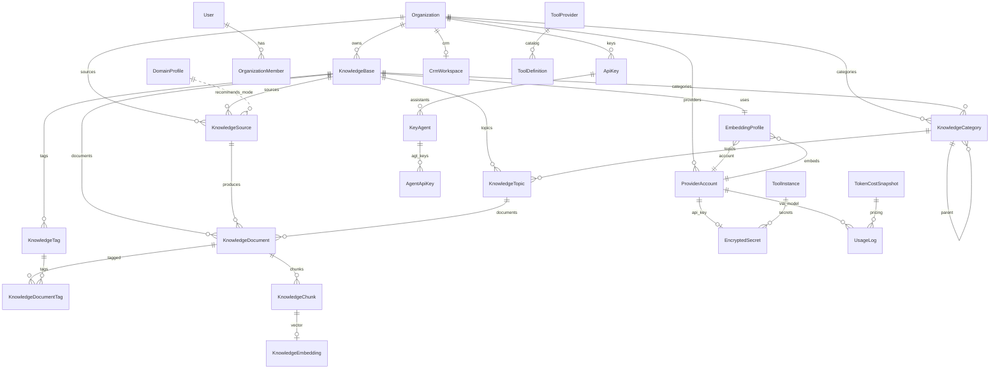

# AI Gateway Platform v2 — Architecture Plan v2.3.1 (FROZEN)

**Статус:** FROZEN — Architecture Freeze v2.3.1  
**Версия:** 2.3.1-plan  
**Базовая версия:** v1.0.0 (stable)  
**Предыдущая:** v2.3.0-plan  
**Дата freeze:** 2026-06-07  
**Delta report:** [`ARCHITECTURE_V2_3_1_DELTA_REPORT.md`](ARCHITECTURE_V2_3_1_DELTA_REPORT.md)  
**Предшественник:** [`ARCHITECTURE_PLAN_v2.3.md`](ARCHITECTURE_PLAN_v2.3.md) (§1–11 без изменений по смыслу)

> **Правило:** реализация кода — только после sign-off v2.3.1 checklist.  
> **Запрещено:** собственный parser; production code до freeze sign-off.

---

## Ревизия v2.3.1 — long-term enhancements

| # | Enhancement | Migration |
|---|-------------|-----------|
| 1 | **KnowledgeSource** — Source Registry | M0.1 |
| 2 | **DomainProfile** — Domain Reputation + ParserMode auto | M0.2 |
| 3 | **Knowledge Taxonomy** — Category, Topic, Tag | M0.3 |
| 4 | **TokenCostSnapshot** — immutable pricing | M0.4 |
| 5 | **ProviderAccount** — unified provider abstraction | M0.5 |

**v2.3 base preserved:** Organization, TenantGuard, ParserClient, okContent gate, agt scopes, EmbeddingProfile, CRM, Memory, Workflow — без изменений.

---

## Содержание

1. [Базовая архитектура (v2.3)](#1-базовая-архитектура-v23)
2. [Source Registry — KnowledgeSource](#2-source-registry--knowledgesource)
3. [Domain Reputation — DomainProfile](#3-domain-reputation--domainprofile)
4. [Knowledge Taxonomy](#4-knowledge-taxonomy)
5. [Token Cost Snapshot](#5-token-cost-snapshot)
6. [Provider Abstraction — ProviderAccount](#6-provider-abstraction--provideraccount)
7. [Updated Ingestion Pipeline](#7-updated-ingestion-pipeline)
8. [Prisma Schema v2.3.1](#8-prisma-schema-v231)
9. [ER Diagram v2.3.1](#9-er-diagram-v231)
10. [API Contract v2.3.1](#10-api-contract-v231)
11. [Migration Plan v2.3.1](#11-migration-plan-v231)
12. [Scalability Report v2.3.1](#12-scalability-report-v231)
13. [Implementation Phases](#13-implementation-phases)
14. [Freeze Sign-off](#14-freeze-sign-off)

---

## 1. Базовая архитектура (v2.3)

Полное описание без изменений: [`ARCHITECTURE_PLAN_v2.3.md`](ARCHITECTURE_PLAN_v2.3.md)

| Domain | Status |
|--------|--------|
| Organization + TenantGuard | ✅ frozen |
| Assistants + AgentApiKey scopes | ✅ frozen |
| Tool Registry + EncryptedSecret | ✅ frozen |
| Internal CRM (1 per org) | ✅ frozen |
| Memory + retention | ✅ frozen |
| Workflow BullMQ | ✅ frozen |
| ParserClient → pars-site.neeklo.ru | ✅ frozen |
| Selectel S3 | ✅ frozen |

**Обновлённая иерархия KB (v2.3.1):**

```
Organization
 └── KnowledgeBase
       ├── KnowledgeSource[]          ← NEW: registry
       ├── KnowledgeCategory[]        ← NEW: taxonomy
       ├── KnowledgeTopic[]
       ├── KnowledgeTag[]
       ├── KnowledgeDocument[]
       │     └── KnowledgeChunk → KnowledgeEmbedding
       └── EmbeddingProfile → ProviderAccount   ← UPDATED FK

Platform (global)
 └── DomainProfile[]                  ← NEW: domain reputation
 └── TokenCostSnapshot[]              ← NEW: pricing history
```

---

## 2. Source Registry — KnowledgeSource

### 2.1 Назначение

`KnowledgeSource` — централизованный реестр **источников данных до парсинга**. Один источник может порождать множество `KnowledgeDocument` (sitemap, domain crawl, RSS).

### 2.2 Enums

```prisma
enum KnowledgeSourceType {
  URL          // single page
  SITEMAP      // sitemap.xml crawl
  DOMAIN       // whole domain crawl
  RSS          // RSS/Atom feed
  FILE         // PDF/DOCX direct URL
  API          // external API endpoint (future)
}

enum CrawlStatus {
  PENDING
  ACTIVE
  COMPLETED
  FAILED
  BLOCKED      // robots.txt disallow or admin block
}

enum RobotsStatus {
  UNKNOWN
  ALLOWED
  DISALLOWED
  PARTIAL
}

enum ParserMode {
  STANDARD
  AGGRESSIVE
  HEADLESS_ONLY
  MARKETPLACE_HARD
  DOCUMENT_FIRST
  LEGAL_FAST
  LEGAL_DEEP
}
```

> `ParserMode` maps to pars-site API: `STANDARD` → `"standard"`, etc.

### 2.3 Model

```prisma
model KnowledgeSource {
  id              String              @id @default(cuid())
  organizationId  String              @map("organization_id")
  knowledgeBaseId String              @map("knowledge_base_id")
  type            KnowledgeSourceType
  name            String?             // user label
  url             String?             // primary URL
  domain          String?             // extracted hostname
  sitemapUrl      String?             @map("sitemap_url")
  robotsStatus    RobotsStatus        @default(UNKNOWN) @map("robots_status")
  crawlStatus     CrawlStatus         @default(PENDING) @map("crawl_status")
  parserMode      ParserMode?         @map("parser_mode")  // null = auto via DomainProfile
  scheduleCron    String?             @map("schedule_cron") // optional re-crawl
  lastParsedAt    DateTime?           @map("last_parsed_at")
  nextParseAt     DateTime?           @map("next_parse_at")
  successCount    Int                 @default(0) @map("success_count")
  failureCount    Int                 @default(0) @map("failure_count")
  successRate     Float?              @map("success_rate")   // computed
  qualityScore    Float?              @map("quality_score")  // avg okContent score
  lastError       String?             @map("last_error") @db.Text
  metadata        Json                @default("{}")
  createdAt       DateTime            @default(now()) @map("created_at")
  updatedAt       DateTime            @updatedAt @map("updated_at")

  organization  Organization    @relation(...)
  knowledgeBase KnowledgeBase   @relation(...)
  documents     KnowledgeDocument[]

  @@index([knowledgeBaseId, crawlStatus])
  @@index([organizationId])
  @@index([nextParseAt])
  @@index([domain])
  @@map("knowledge_sources")
}
```

### 2.4 Связь с документами

```prisma
model KnowledgeDocument {
  // ... v2.3 fields
  knowledgeSourceId String?  @map("knowledge_source_id")  // NEW
  categoryId        String?  @map("category_id")          // NEW v2.3.1
  topicId           String?  @map("topic_id")              // NEW v2.3.1

  knowledgeSource KnowledgeSource?  @relation(...)
  category        KnowledgeCategory? @relation(...)
  topic           KnowledgeTopic?    @relation(...)
  tags            KnowledgeDocumentTag[]
}
```

### 2.5 Crawl scheduling

BullMQ cron worker `knowledge-source-scheduler`:
- Query: `WHERE crawl_status = ACTIVE AND next_parse_at <= now()`
- Sitemap/DOMAIN: discover URLs → create KnowledgeDocument per URL
- RSS: poll feed → new items → documents
- Update `successCount`, `failureCount`, `successRate`, `lastParsedAt`

### 2.6 API usage

| Action | Flow |
|--------|------|
| Add single URL | Create KnowledgeSource(type=URL) → ingest job → KnowledgeDocument |
| Add sitemap | Create KnowledgeSource(type=SITEMAP) → expand URLs → N documents |
| Re-crawl | POST sources/:id/crawl → reset nextParseAt |

---

## 3. Domain Reputation — DomainProfile

### 3.1 Назначение

Platform-global накопление статистики парсинга по домену. **Не хранит контент и tenant-specific URLs** — только агрегаты.

### 3.2 Model

```prisma
model DomainProfile {
  id                  String      @id @default(cuid())
  domain              String      @unique  // e.g. consultant.ru
  totalRequests       Int         @default(0) @map("total_requests")
  successfulParses    Int         @default(0) @map("successful_parses")
  failedParses        Int         @default(0) @map("failed_parses")
  successRate         Float?      @map("success_rate")
  averageChars        Int?        @map("average_chars")
  averageQualityScore Float?      @map("average_quality_score")
  recommendedMode     ParserMode? @map("recommended_mode")
  antiBotDetected     Boolean     @default(false) @map("anti_bot_detected")
  captchaDetected     Boolean     @default(false) @map("captcha_detected")
  lastParsedAt        DateTime?   @map("last_parsed_at")
  metadata            Json        @default("{}")
  createdAt           DateTime    @default(now()) @map("created_at")
  updatedAt           DateTime    @updatedAt @map("updated_at")

  @@map("domain_profiles")
}
```

### 3.3 Seed rules (platform defaults)

| Domain pattern | recommendedMode |
|----------------|-----------------|
| `consultant.ru`, `pravo.gov.ru` | LEGAL_FAST |
| legal codes (UK/UPK pipeline) | LEGAL_DEEP |
| `sudrf.ru`, `sudact.ru` | LEGAL_FAST |
| `ozon.ru`, `wildberries.ru`, `market.yandex.ru` | MARKETPLACE_HARD |
| known anti-bot (from stats) | AGGRESSIVE |
| default | STANDARD |

Admin can override via seed migration + runtime learning updates `recommendedMode` when `successRate` crosses thresholds.

### 3.4 Parser mode resolution

```typescript
function resolveParserMode(source: KnowledgeSource, domain: string): ParserMode {
  if (source.parserMode) return source.parserMode;           // user override
  const profile = await domainProfile.findUnique({ domain });
  if (profile?.recommendedMode) return profile.recommendedMode;
  return ParserMode.STANDARD;
}

// Map to pars-site API string
const modeApi = resolveParserMode(source, domain).toLowerCase();
await parserClient.parse({ url, mode: modeApi, timeoutMs });
```

### 3.5 Post-parse update

After each parse attempt:
```
DomainProfile.totalRequests++
if (ok && okContent) successfulParses++, update averageChars
else failedParses++, set antiBotDetected if contentValidation.reason = anti_bot_or_stub
recompute successRate, averageQualityScore
if successRate < 0.5 && recommendedMode !== HEADLESS_ONLY → bump mode severity
```

Also update `KnowledgeSource.successCount/failureCount/qualityScore`.

---

## 4. Knowledge Taxonomy

### 4.1 Models

```prisma
model KnowledgeCategory {
  id              String   @id @default(cuid())
  organizationId  String   @map("organization_id")
  knowledgeBaseId String   @map("knowledge_base_id")
  parentId        String?  @map("parent_id")
  name            String
  slug            String
  description     String?  @db.Text
  sortOrder       Int      @default(0) @map("sort_order")
  createdAt       DateTime @default(now()) @map("created_at")
  updatedAt       DateTime @updatedAt @map("updated_at")

  organization  Organization      @relation(...)
  knowledgeBase KnowledgeBase     @relation(...)
  parent        KnowledgeCategory? @relation("CategoryTree", ...)
  children      KnowledgeCategory[] @relation("CategoryTree")
  topics        KnowledgeTopic[]
  documents     KnowledgeDocument[]

  @@unique([knowledgeBaseId, slug])
  @@index([organizationId])
  @@index([parentId])
  @@map("knowledge_categories")
}

model KnowledgeTopic {
  id              String   @id @default(cuid())
  organizationId  String   @map("organization_id")
  knowledgeBaseId String   @map("knowledge_base_id")
  categoryId      String   @map("category_id")
  name            String
  slug            String
  description     String?  @db.Text
  createdAt       DateTime @default(now()) @map("created_at")
  updatedAt       DateTime @updatedAt @map("updated_at")

  organization  Organization      @relation(...)
  knowledgeBase KnowledgeBase     @relation(...)
  category      KnowledgeCategory @relation(...)
  documents     KnowledgeDocument[]

  @@unique([knowledgeBaseId, slug])
  @@index([categoryId])
  @@map("knowledge_topics")
}

model KnowledgeTag {
  id              String   @id @default(cuid())
  organizationId  String   @map("organization_id")
  knowledgeBaseId String   @map("knowledge_base_id")
  name            String
  slug            String
  createdAt       DateTime @default(now()) @map("created_at")

  organization  Organization           @relation(...)
  knowledgeBase KnowledgeBase          @relation(...)
  documents     KnowledgeDocumentTag[]

  @@unique([knowledgeBaseId, slug])
  @@map("knowledge_tags")
}

model KnowledgeDocumentTag {
  documentId String @map("document_id")
  tagId      String @map("tag_id")

  document KnowledgeDocument @relation(...)
  tag      KnowledgeTag      @relation(...)

  @@id([documentId, tagId])
  @@map("knowledge_document_tags")
}
```

### 4.2 Hierarchy

```
KnowledgeCategory (tree)
  → KnowledgeTopic
    → KnowledgeDocument
      → KnowledgeChunk
      ↔ KnowledgeTag (M:N)
```

### 4.3 Auto-classification (Etap 5)

```
Parser → okContent gate → Chunking
  → BullMQ: taxonomy-classify
  → LLM (cheap model via ProviderAccount):
       input: title + first 2 chunks
       output: { categorySlug, topicSlug, tags[] }
  → upsert Category/Topic/Tag if autoCreate=true (KB setting)
  → assign document.categoryId, topicId, tags
```

**KB settings (extend KnowledgeBase):**
```prisma
autoClassifyEnabled  Boolean @default(false) @map("auto_classify_enabled")
autoCreateTaxonomy   Boolean @default(false) @map("auto_create_taxonomy")
```

### 4.4 RAG with taxonomy filter

```
POST /knowledge-bases/:id/search
{
  "query": "...",
  "topK": 10,
  "categoryId": "...",      // optional pre-filter
  "topicId": "...",
  "tagSlugs": ["..."]
}
```

Vector search scoped to documents matching taxonomy → reduces candidate chunks 10–100×.

---

## 5. Token Cost Snapshot

### 5.1 Model

```prisma
model TokenCostSnapshot {
  id                String    @id @default(cuid())
  provider          String    // openrouter, openai, ...
  model             String    // anthropic/claude-3.5-sonnet
  inputPrice        Decimal   @map("input_price") @db.Decimal(12, 8)   // USD per token
  outputPrice       Decimal   @map("output_price") @db.Decimal(12, 8)
  cachedInputPrice  Decimal?  @map("cached_input_price") @db.Decimal(12, 8)
  cachedOutputPrice Decimal?  @map("cached_output_price") @db.Decimal(12, 8)
  effectiveFrom     DateTime  @map("effective_from")
  effectiveTo       DateTime? @map("effective_to")  // null = current
  createdAt         DateTime  @default(now()) @map("created_at")

  usageLogs UsageLog[]

  @@unique([provider, model, effectiveFrom])
  @@index([provider, model, effectiveFrom])
  @@map("token_cost_snapshots")
}
```

### 5.2 UsageLog extension

```prisma
model UsageLog {
  // ... existing v1 fields
  tokenCostSnapshotId String?  @map("token_cost_snapshot_id")
  costUsd             Decimal? @map("cost_usd") @db.Decimal(12, 6)  // frozen at request time

  tokenCostSnapshot TokenCostSnapshot? @relation(...)
}
```

### 5.3 Resolution at request time

```typescript
async function resolveCostSnapshot(provider: string, model: string): Promise<TokenCostSnapshot> {
  return prisma.tokenCostSnapshot.findFirst({
    where: {
      provider,
      model,
      effectiveFrom: { lte: new Date() },
      OR: [{ effectiveTo: null }, { effectiveTo: { gt: new Date() } }],
    },
    orderBy: { effectiveFrom: 'desc' },
  });
}

// On chat completion:
const snapshot = await resolveCostSnapshot('openrouter', model);
const costUsd = tokensIn * snapshot.inputPrice + tokensOut * snapshot.outputPrice;
await usageLog.create({ ..., tokenCostSnapshotId: snapshot.id, costUsd });
```

### 5.4 Admin sync

- Seed snapshots from OpenRouter pricing API (weekly cron)
- On price change: close previous snapshot (`effectiveTo = now()`), insert new row
- Historical reports always join via `tokenCostSnapshotId` — never recalculate

---

## 6. Provider Abstraction — ProviderAccount

### 6.1 Enum

```prisma
enum AIProvider {
  OPENAI
  OPENROUTER
  ANTHROPIC
  GEMINI
  DEEPSEEK
  MISTRAL
  OLLAMA
  CUSTOM
}

enum ProviderAccountStatus {
  ACTIVE
  INACTIVE
  ERROR
}
```

### 6.2 Model

```prisma
model ProviderAccount {
  id             String                @id @default(cuid())
  organizationId String?               @map("organization_id")  // null = platform default
  provider       AIProvider
  name           String                // "OpenRouter Production"
  isDefault      Boolean               @default(false) @map("is_default")
  status         ProviderAccountStatus @default(ACTIVE)
  baseUrl        String?               @map("base_url")  // Ollama, CUSTOM
  apiKeySecretId String?               @map("api_key_secret_id")  // → EncryptedSecret
  metadata       Json                  @default("{}")
  createdAt      DateTime              @default(now()) @map("created_at")
  updatedAt      DateTime              @updatedAt @map("updated_at")

  organization      Organization?      @relation(...)
  apiKeySecret      EncryptedSecret?   @relation(...)
  embeddingProfiles EmbeddingProfile[]
  // future: chatModelProfiles, rerankerProfiles, ocrProfiles

  @@index([organizationId, provider])
  @@map("provider_accounts")
}
```

### 6.3 EncryptedSecret extension

```prisma
model EncryptedSecret {
  // ... v2.3 fields
  providerAccountId String? @map("provider_account_id")  // NEW

  providerAccount ProviderAccount? @relation(...)
}
```

### 6.4 EmbeddingProfile update

```prisma
model EmbeddingProfile {
  // ... v2.3 fields
  providerAccountId String? @map("provider_account_id")  // preferred over provider string
  provider          String  @default("openrouter")       // deprecated, keep for compat

  providerAccount ProviderAccount? @relation(...)
}
```

### 6.5 Usage matrix

| Capability | ProviderAccount | Etap |
|------------|-----------------|------|
| Chat completions | KeyAgent.modelChain → account | 1 |
| Embeddings | EmbeddingProfile → account | 4–5 |
| Rerankers | future RerankerProfile | 8 |
| OCR | future OcrProfile | 8 |
| Vision | model via account | 6 |
| Taxonomy LLM classify | platform default account | 5 |
| MCP | separate ToolProvider | 6 |

### 6.6 Platform default seed (M0.5)

```sql
INSERT INTO provider_accounts (id, organization_id, provider, name, is_default, status)
VALUES ('platform-openrouter', NULL, 'OPENROUTER', 'Platform OpenRouter', true, 'ACTIVE');
-- apiKeySecretId → EncryptedSecret from env OPENROUTER_API_KEY
```

Org can add own ProviderAccount to override platform default for BYOK (bring your own key).

---

## 7. Updated Ingestion Pipeline

### 7.1 Full flow (v2.3.1)

```
1. User: POST /knowledge-bases/:id/sources  { type, url, parserMode? }
2. Create KnowledgeSource (extract domain, crawlStatus=PENDING)
3. DomainProfile lookup → resolve parserMode if not set
4. BullMQ: ingest-source
5. ParserClient.parse({ url, mode, timeoutMs, async? })
6. Quality gate:
     ok !== true        → FAILED, update Source + DomainProfile
     okContent !== true → SKIPPED_QUALITY, update stats, NO index
     else               → continue
7. Create/update KnowledgeDocument (knowledgeSourceId)
8. S3: raw/ + processed/
9. Store parser metadata on Document
10. Chunking → KnowledgeChunk
11. Embedding (EmbeddingProfile → ProviderAccount)
12. Optional: taxonomy-classify job (Etap 5)
13. Update KnowledgeSource stats + DomainProfile stats
14. Schedule nextParseAt if recurring source
```

### 7.2 Sitemap / Domain crawl

```
KnowledgeSource(type=SITEMAP)
  → fetch sitemap URLs
  → for each URL: KnowledgeDocument + ingest-url job (inherits source.parserMode)
  → KnowledgeSource.crawlStatus = ACTIVE until all jobs complete
```

---

## 8. Prisma Schema v2.3.1

### 8.1 New models summary

| Model | Migration | Etap logic |
|-------|-----------|------------|
| KnowledgeSource | M0.1 | M4 |
| DomainProfile | M0.2 | M4 |
| KnowledgeCategory | M0.3 | M4 UI, M5 classify |
| KnowledgeTopic | M0.3 | M4 |
| KnowledgeTag | M0.3 | M4 |
| KnowledgeDocumentTag | M0.3 | M4 |
| TokenCostSnapshot | M0.4 | M0 |
| ProviderAccount | M0.5 | M0 seed, M1 wire |

### 8.2 Updated models (v2.3 → v2.3.1)

| Model | Change |
|-------|--------|
| KnowledgeDocument | + knowledgeSourceId, categoryId, topicId |
| KnowledgeBase | + autoClassifyEnabled, autoCreateTaxonomy |
| EmbeddingProfile | + providerAccountId |
| UsageLog | + tokenCostSnapshotId, costUsd |
| EncryptedSecret | + providerAccountId |

### 8.3 Full v2.3.1 model count

**Total new tables:** +8 (KnowledgeSource, DomainProfile, 3 taxonomy + junction, TokenCostSnapshot, ProviderAccount)

**Unchanged from v2.3:** Organization, Assistants, CRM, Tools, Memory, Workflow, Parser — see v2.3 doc.

---

## 9. ER Diagram v2.3.1



---

## 10. API Contract v2.3.1

### 10.1 Source Registry (NEW)

```
GET    /api/v1/knowledge-bases/:id/sources
POST   /api/v1/knowledge-bases/:id/sources
       { type, url?, sitemapUrl?, name?, parserMode?, scheduleCron? }
GET    /api/v1/knowledge-bases/:id/sources/:sourceId
PATCH  /api/v1/knowledge-bases/:id/sources/:sourceId
DELETE /api/v1/knowledge-bases/:id/sources/:sourceId
POST   /api/v1/knowledge-bases/:id/sources/:sourceId/crawl    trigger now
POST   /api/v1/knowledge-bases/:id/sources/:sourceId/pause
POST   /api/v1/knowledge-bases/:id/sources/:sourceId/resume
```

**Response includes:** crawlStatus, successRate, qualityScore, lastParsedAt, nextParseAt, parserMode.

### 10.2 Documents (updated — backward compatible)

```
POST   /api/v1/knowledge-bases/:id/documents/url
       { url, parserMode? }
       → internally creates KnowledgeSource(type=URL) + Document

GET    /api/v1/knowledge-bases/:id/documents
       ?sourceId=&categoryId=&topicId=&tag=
```

### 10.3 Taxonomy (NEW)

```
GET    /api/v1/knowledge-bases/:id/categories              tree
POST   /api/v1/knowledge-bases/:id/categories
PATCH  /api/v1/knowledge-bases/:id/categories/:id
DELETE /api/v1/knowledge-bases/:id/categories/:id

GET    /api/v1/knowledge-bases/:id/topics?categoryId=
POST   /api/v1/knowledge-bases/:id/topics
PATCH  /api/v1/knowledge-bases/:id/topics/:id

GET    /api/v1/knowledge-bases/:id/tags
POST   /api/v1/knowledge-bases/:id/tags
POST   /api/v1/knowledge-bases/:id/documents/:docId/tags   { tagIds[] }
DELETE /api/v1/knowledge-bases/:id/documents/:docId/tags/:tagId
```

### 10.4 Search (updated)

```
POST   /api/v1/knowledge-bases/:id/search
{
  "query": "...",
  "topK": 10,
  "categoryId": "optional",
  "topicId": "optional",
  "tagSlugs": ["optional"]
}
```

### 10.5 Domain Profiles (admin)

```
GET    /api/v1/admin/domain-profiles
GET    /api/v1/admin/domain-profiles/:domain
PATCH  /api/v1/admin/domain-profiles/:domain   { recommendedMode? }
```

### 10.6 Provider Accounts (NEW)

```
GET    /api/v1/provider-accounts
POST   /api/v1/provider-accounts
       { provider, name, baseUrl?, apiKey? }
GET    /api/v1/provider-accounts/:id
PATCH  /api/v1/provider-accounts/:id
DELETE /api/v1/provider-accounts/:id
POST   /api/v1/provider-accounts/:id/set-default
POST   /api/v1/provider-accounts/:id/test          connectivity check
```

### 10.7 Token Cost Snapshots (admin)

```
GET    /api/v1/admin/token-cost-snapshots?provider=&model=
POST   /api/v1/admin/token-cost-snapshots
       { provider, model, inputPrice, outputPrice, effectiveFrom }
POST   /api/v1/admin/token-cost-snapshots/sync     pull from OpenRouter
```

### 10.8 Unchanged from v2.3

Organization, Assistants, CRM, Tools, Memory, Workflow, Gateway — see [`ARCHITECTURE_PLAN_v2.3.md`](ARCHITECTURE_PLAN_v2.3.md) §14.

---

## 11. Migration Plan v2.3.1

### 11.1 Full migration sequence

| # | Migration | Tables / changes | Apply |
|---|-----------|------------------|-------|
| M0 | Foundation | organizations, members, plan_limits, api_keys.organization_id | Etap 0 |
| **M0.4** | token_cost_snapshots | token_cost_snapshots, usage_logs FK + costUsd | **Etap 0** |
| **M0.5** | provider_accounts | provider_accounts, encrypted_secrets FK, seed platform default | **Etap 0** |
| M1 | Assistants | key_agents, agent_api_keys, variables | Etap 1 |
| M2 | Tools | tool_providers, instances, encrypted_secrets | Etap 2 |
| M3 | CRM | crm_* tables | Etap 3 |
| **M0.1** | source_registry | knowledge_sources, documents.knowledge_source_id | **Etap 4** |
| **M0.2** | domain_reputation | domain_profiles, seed known domains | **Etap 4** |
| **M0.3** | taxonomy | categories, topics, tags, document_tags, document FKs | **Etap 4** |
| M4 | Knowledge | knowledge_bases, documents, versions, jobs, junctions | Etap 4 |
| M5 | Vectors | pgvector, chunks, embeddings, HNSW | Etap 5 |
| M6 | Memory | conversations, messages, agent_memories | Etap 5.5 |
| M7 | Workflows | workflows, steps, runs | Etap 6–7 |
| M8 | Scale | partitions, indexes | Etap 8 |

### 11.2 M0.1 backfill

```sql
-- For existing documents (post v1 migration):
INSERT INTO knowledge_sources (id, organization_id, knowledge_base_id, type, url, domain, crawl_status)
SELECT gen_random_uuid(), d.organization_id, d.knowledge_base_id, 'URL', d.source_url,
       regexp_replace(d.source_url, '^https?://([^/]+).*', '\1'), 'COMPLETED'
FROM knowledge_documents d WHERE d.source_url IS NOT NULL;

UPDATE knowledge_documents d
SET knowledge_source_id = s.id
FROM knowledge_sources s
WHERE s.url = d.source_url AND s.knowledge_base_id = d.knowledge_base_id;
```

### 11.3 M0.2 domain seed

```sql
INSERT INTO domain_profiles (domain, recommended_mode, metadata) VALUES
  ('consultant.ru', 'LEGAL_FAST', '{"seed": true}'),
  ('publication.pravo.gov.ru', 'LEGAL_FAST', '{"seed": true}'),
  ('ozon.ru', 'MARKETPLACE_HARD', '{"seed": true}'),
  ('wildberries.ru', 'MARKETPLACE_HARD', '{"seed": true}'),
  ('sudrf.ru', 'LEGAL_FAST', '{"seed": true}')
ON CONFLICT (domain) DO NOTHING;
```

### 11.4 M0.4 pricing seed

Seed current OpenRouter prices for models in KeyModelProfiles (aura, neeklo, auto).

### 11.5 M0.5 platform account

Create platform ProviderAccount(OPENROUTER) linked to existing env API key via EncryptedSecret.

---

## 12. Scalability Report v2.3.1

### 12.1 Capacity targets (updated)

| Resource | Target | v2.3.1 mechanism |
|----------|--------|------------------|
| KnowledgeSources | 100K+ per platform | Indexed by kb_id + crawl_status |
| Documents | 1M+ | Source registry prevents orphan metadata |
| Chunks | 10M+ | Taxonomy pre-filter + HNSW per KB |
| DomainProfiles | 50K domains | Single row per domain, O(1) lookup |
| UsageLogs | 100M+ | Partition by month + snapshot FK (no recalc) |
| ProviderAccounts | 10K orgs × 5 providers | Indexed by org_id |

### 12.2 Performance improvements

| Scenario | v2.3 | v2.3.1 gain |
|----------|------|-------------|
| Re-crawl 10K URLs | Manual re-add | KnowledgeSource scheduler |
| Parser mode selection | Static/heuristic | DomainProfile learning −30% retries |
| RAG on 1M chunks | Full vector scan | Taxonomy filter → 10× smaller set |
| Cost report 12 months | Recalc with current prices | TokenCostSnapshot → accurate |
| Add new AI provider | Schema change | ProviderAccount row |

### 12.3 Storage estimates (10M chunks)

| Component | Size |
|-----------|------|
| knowledge_chunks | ~20GB text |
| knowledge_embeddings vector(3072) | ~120GB |
| knowledge_sources | ~500MB |
| domain_profiles | ~50MB |
| token_cost_snapshots | ~10MB |
| taxonomy metadata | ~1GB |

### 12.4 Critical indexes (add in M8)

```sql
CREATE INDEX CONCURRENTLY idx_sources_next_parse
  ON knowledge_sources(next_parse_at)
  WHERE crawl_status = 'ACTIVE';

CREATE INDEX CONCURRENTLY idx_docs_taxonomy
  ON knowledge_documents(knowledge_base_id, category_id, topic_id);

CREATE INDEX CONCURRENTLY idx_usage_snapshot
  ON usage_logs(token_cost_snapshot_id)
  WHERE token_cost_snapshot_id IS NOT NULL;
```

### 12.5 Bottleneck watchlist

| Bottleneck | Threshold | Action |
|------------|-----------|--------|
| DomainProfile write contention | >1000 parses/min same domain | Batch update queue |
| Taxonomy classify LLM | >10K docs/day | Rate limit; batch classify |
| Source scheduler lag | nextParseAt delay >1h | Scale BullMQ workers |
| TokenCostSnapshot stale | >7 days | Alert admin |

---

## 13. Implementation Phases

| Etap | v2.3 scope | v2.3.1 additions |
|------|------------|------------------|
| **0** | Org, TenantGuard, ParserClient shell, S3, BullMQ | **M0.4** TokenCostSnapshot, **M0.5** ProviderAccount seed |
| **1** | Agent Builder, agt_ keys | Wire chat → ProviderAccount |
| **2** | Tools, EncryptedSecret | — |
| **3** | CRM | — |
| **4** | KB + Parser ingest | **M0.1** Source, **M0.2** DomainProfile, **M0.3** Taxonomy schema, source API |
| **5** | RAG, REEMBED | Taxonomy classify job, filtered search |
| **5.5** | Memory | UsageLog → TokenCostSnapshot on every chat |
| **6–8** | Integrations, Workflow, Scale | ProviderAccount for rerank/OCR (future) |

**Etap 0 exit criteria (updated):**
- JWT org context + TenantGuard ✅
- Parser health check ✅
- TokenCostSnapshot seeded ✅
- Platform ProviderAccount(OPENROUTER) active ✅

---

## 14. Freeze Sign-off

| Document | Status |
|----------|--------|
| Architecture Plan v2.3.1 | ✅ FROZEN |
| Delta Report | ✅ [`ARCHITECTURE_V2_3_1_DELTA_REPORT.md`](ARCHITECTURE_V2_3_1_DELTA_REPORT.md) |
| ER Diagram | ✅ §9 |
| Prisma Design | ✅ §8 |
| API Contract | ✅ §10 |
| Migration Plan | ✅ §11 (M0.1–M0.5) |
| Scalability Report | ✅ §12 |
| GO/NO-GO | ✅ **GO** |

**Supersedes:** [`ARCHITECTURE_PLAN_v2.3.md`](ARCHITECTURE_PLAN_v2.3.md)

**Awaiting:** «Утверждаю Architecture Freeze v2.3.1» → Etap 0 on `feature/v2-platform`.
