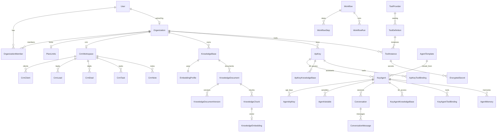

# AI Gateway Platform v2 — Architecture Plan v2.3 (FROZEN)

**Статус:** SUPERSEDED — заменён на **[ARCHITECTURE_PLAN_v2.3.1.md](ARCHITECTURE_PLAN_v2.3.1.md)**  
**Версия:** 2.3.0-plan (historical)  
**Базовая версия:** v1.0.0 (stable)  
**Предыдущая:** v2.2.0-plan  
**Дата freeze:** 2026-06-07  
**Связанный отчёт:** [`ARCHITECTURE_FREEZE_REPORT.md`](ARCHITECTURE_FREEZE_REPORT.md)

> **Правило:** реализация кода начинается **только после sign-off** checklist в Freeze Report.  
> **Запрещено:** собственный parser внутри AI Gateway.

---

## Ревизия v2.3 — финальный аудит

| Приоритет | Изменение |
|-----------|-----------|
| **P0** | `ApiKey.organizationId` — ключ принадлежит Organization |
| **P0** | **TenantGuard** — JWT `organizationId`, middleware на все tenant-scoped routes |
| **P0** | **ParserClientModule** → `https://pars-site.neeklo.ru` (PRIMARY, единственный parser) |
| **P0** | **okContent gate** — не индексировать при `ok=true && okContent=false` |
| **P1** | **AgentApiKeyScope[]** — permissions на agt_ keys |
| **P1** | **EmbeddingProfile** — multi-model + REEMBED migration |
| **P1** | **KnowledgeDocumentVersion** — versioning + reindex |
| **P1** | **Memory retention policy** — 90d default, summarization |
| **P1** | **Workflow execution model** — BullMQ, retry, DLQ |
| **P2** | **Shared agents** — clone from template within org (not cross-tenant) |
| **P2** | S3 prefix structure frozen: raw/processed/ocr/chunks/exports |

---

## Содержание

1. [Терминология](#1-терминология)
2. [Organization & Multi-tenant](#2-organization--multi-tenant)
3. [Assistants & Agent Keys](#3-assistants--agent-keys)
4. [Knowledge Base & RAG](#4-knowledge-base--rag)
5. [Embeddings & Scale](#5-embeddings--scale)
6. [Tool Registry](#6-tool-registry)
7. [Internal CRM](#7-internal-crm)
8. [Memory](#8-memory)
9. [Workflow Engine](#9-workflow-engine)
10. [Parser Integration](#10-parser-integration)
11. [S3 Storage (Selectel)](#11-s3-storage-selectel)
12. [Prisma Schema v2.3](#12-prisma-schema-v23)
13. [ER Diagram](#13-er-diagram)
14. [API Contract](#14-api-contract)
15. [Migration Plan](#15-migration-plan)
16. [Implementation Phases](#16-implementation-phases)
17. [Risk / Security / Scalability](#17-risk--security--scalability)

---

## 1. Терминология

| UI (RU) | Code | Описание |
|---------|------|----------|
| AI Ассистент | `KeyAgent` | Настраиваемый ассистент |
| Шаблон | `AgentTemplate` | Platform preset + marketplace |
| API-ключ | `ApiKey` (`agw_`) | Billing, models; **∈ Organization** |
| Ключ ассистента | `AgentApiKey` (`agt_`) | N keys, environments, scopes |
| Организация | `Organization` | Tenant root: CRM, KB, keys |
| База знаний | `KnowledgeBase` | RAG; owner = Organization |

**Billing:** всегда с parent `ApiKey` (`agw_`). `AgentApiKey` — auth + scope + analytics.

---

## 2. Organization & Multi-tenant

### 2.1 Ownership model (frozen)

```
Organization (tenant)
 ├── OrganizationMember[]     User + role
 ├── PlanLimits
 ├── CrmWorkspace (1:1)
 ├── KnowledgeBase[]
 ├── ApiKey[]                 ← billing keys belong here
 └── ToolInstance[]

User
 ├── activeOrganizationId     JWT context
 └── OrganizationMember[] → Organization
```

### 2.2 Active Organization Context

```typescript
// JWT payload (panel + internal services)
interface AuthContext {
  userId: string;
  organizationId: string;      // from User.activeOrganizationId
  role: OrganizationRole;      // from OrganizationMember
}

// Every tenant-scoped service method:
async findAll(ctx: AuthContext) {
  return this.prisma.knowledgeBase.findMany({
    where: { organizationId: ctx.organizationId },
  });
}
```

**TenantGuard (NestJS):** validates JWT, injects `AuthContext`, rejects if resource.organizationId !== ctx.organizationId.

### 2.3 Personal org on signup

При регистрации: `Organization(type=PERSONAL, name=user.email)`, `OrganizationMember(OWNER)`, `User.activeOrganizationId = org.id`, все существующие ApiKey мигрируют в personal org.

### 2.4 Future B2B

| Feature | Schema ready | Implementation |
|---------|--------------|----------------|
| COMPANY org | ✅ | Etap 0.5 UI |
| Invite members | ✅ OrganizationMember | Etap 0.5 |
| Role-based panel | ✅ OrganizationRole | Etap 0.5 |
| SSO/SAML | ❌ v3 | — |
| Org-level billing | PlanLimits on org | Etap 8 |

### 2.5 Tenant isolation rules

1. **Never** accept `organizationId` from request body for authorization — only from JWT.
2. All FK lookups must verify org ownership before mutation.
3. Cross-org queries forbidden except platform ADMIN role.
4. S3 keys prefixed `{organizationId}/...`.
5. CRM tools resolve `organizationId` from auth, never from tool args.

---

## 3. Assistants & Agent Keys

### 3.1 Hierarchy

```
ApiKey (agw_) — organizationId
 └── KeyAgent[] — «AI Ассистенты»
       ├── AgentApiKey[] — N keys (prod, test, crm, telegram…)
       ├── AgentVariable[]
       ├── KeyAgentKnowledgeBase[] — KB access
       ├── KeyAgentToolBinding[]
       ├── Conversation[]
       └── modelChain[]
```

### 3.2 AgentApiKey — multiple keys + scopes

```prisma
enum AgentApiKeyEnvironment {
  PRODUCTION
  STAGING
  TEST
  CRM
  TELEGRAM
  CUSTOM
}

enum AgentApiKeyScope {
  CHAT              // POST /assistants/:slug/chat
  CHAT_STREAM       // SSE streaming
  TOOLS_INVOKE      // tool execution via assistant
  KB_READ           // RAG search only
  MEMORY_READ       // read conversation history
  MEMORY_WRITE      // append messages
}

model AgentApiKey {
  id           String                   @id @default(cuid())
  keyAgentId   String                   @map("key_agent_id")
  apiKeyId     String                   @map("api_key_id")
  name         String
  environment  AgentApiKeyEnvironment   @default(PRODUCTION)
  scopes       AgentApiKeyScope[]       @default([CHAT, TOOLS_INVOKE, KB_READ, MEMORY_READ, MEMORY_WRITE])
  keyHash      String                   @unique @map("key_hash")
  keyPrefix    String                   @map("key_prefix")
  keyEncrypted String?                  @map("key_encrypted")
  status       ApiKeyStatus             @default(ACTIVE)
  allowedIps   String[]                 @default([]) @map("allowed_ips")
  expiresAt    DateTime?                @map("expires_at")
  revokedAt    DateTime?                @map("revoked_at")
  lastUsedAt   DateTime?                @map("last_used_at")
  createdAt    DateTime                 @default(now()) @map("created_at")

  keyAgent KeyAgent @relation(...)
  apiKey   ApiKey   @relation(...)

  @@index([keyAgentId])
  @@index([apiKeyId])
  @@map("agent_api_keys")
}
```

### 3.3 Rotation & Revoke

| Action | Behavior |
|--------|----------|
| **Regenerate** | New keyHash; old keyHash invalidated; audit log |
| **Revoke** | status=INACTIVE, revokedAt=now(); immediate 401 |
| **Expire** | expiresAt checked on auth; auto-reject |

### 3.4 Marketplace, Public, Shared

```prisma
model AgentTemplate {
  // ... existing fields
  isPublic       Boolean @default(false) @map("is_public")
  isMarketplace  Boolean @default(false) @map("is_marketplace")
  installCount   Int     @default(0) @map("install_count")
}
```

| Concept | Definition |
|---------|------------|
| **Marketplace** | `isMarketplace=true` templates in catalog; install → clone KeyAgent in user's org |
| **Public** | `isPublic=true` visible without admin; read-only template |
| **Shared** | Clone within same Organization only; **no cross-tenant sharing** |

---

## 4. Knowledge Base & RAG

### 4.1 Ownership vs Access

```
Organization ──owns──► KnowledgeBase
ApiKey ──access──► ApiKeyKnowledgeBase
KeyAgent ──access──► KeyAgentKnowledgeBase

effectiveKbIds = union(apiKeyAccess, agentAccess)
RAG priority: agent bindings > key bindings
```

### 4.2 Document versioning

```prisma
model KnowledgeDocument {
  id              String   @id @default(cuid())
  knowledgeBaseId String   @map("knowledge_base_id")
  organizationId  String   @map("organization_id")  // denormalized for TenantGuard
  sourceType      KnowledgeSourceType
  sourceUrl       String?  @map("source_url")
  title           String?
  status          KnowledgeDocumentStatus @default(PENDING)
  currentVersion  Int      @default(1) @map("current_version")
  // S3 refs
  rawS3Key        String?  @map("raw_s3_key")
  processedS3Key  String?  @map("processed_s3_key")
  // Parser quality metadata
  parserJobId     String?  @map("parser_job_id")
  okContent       Boolean? @map("ok_content")
  contentValidation Json?  @map("content_validation")
  parserChars     Int?     @map("parser_chars")
  parserWarnings  Json?    @map("parser_warnings")
  createdAt       DateTime @default(now()) @map("created_at")
  updatedAt       DateTime @updatedAt @map("updated_at")

  knowledgeBase KnowledgeBase @relation(...)
  versions      KnowledgeDocumentVersion[]
  chunks        KnowledgeChunk[]

  @@index([knowledgeBaseId])
  @@index([organizationId])
  @@map("knowledge_documents")
}

model KnowledgeDocumentVersion {
  id         String   @id @default(cuid())
  documentId String   @map("document_id")
  version    Int
  changeNote String?  @map("change_note")
  s3Key      String   @map("s3_key")
  charCount  Int      @map("char_count")
  createdAt  DateTime @default(now()) @map("created_at")

  document KnowledgeDocument @relation(...)

  @@unique([documentId, version])
  @@map("knowledge_document_versions")
}
```

### 4.3 Chunk strategy (per KnowledgeBase)

```prisma
model KnowledgeBase {
  // ...
  chunkSize       Int    @default(1000) @map("chunk_size")
  chunkOverlap    Int    @default(200) @map("chunk_overlap")
  chunkStrategy   ChunkStrategy @default(RECURSIVE) @map("chunk_strategy")
  embeddingProfileId String @map("embedding_profile_id")
}

enum ChunkStrategy {
  RECURSIVE      // langchain RecursiveCharacterTextSplitter
  PARAGRAPH      // split by \n\n
  SEMANTIC       // future: semantic boundaries (v3)
  LEGAL_ARTICLE  // for legal docs: article/paragraph markers
}
```

### 4.4 Indexing pipeline

```
URL/File upload
  → ParserClient (pars-site)
  → Quality gate (okContent)
  → S3 raw/ + processed/
  → Chunking (KB settings)
  → Embedding (EmbeddingProfile)
  → KnowledgeChunk + KnowledgeEmbedding
  → status=INDEXED
```

### 4.5 Reindex & jobs

```prisma
enum KnowledgeJobType {
  INGEST_URL
  INGEST_FILE
  REINDEX
  REEMBED
  DELETE
}

enum KnowledgeJobStatus {
  PENDING
  PARSING
  SKIPPED_QUALITY      // okContent=false
  CHUNKING
  EMBEDDING
  INDEXED
  FAILED
}
```

---

## 5. Embeddings & Scale

### 5.1 EmbeddingProfile (NEW)

```prisma
model EmbeddingProfile {
  id           String   @id @default(cuid())
  organizationId String? @map("organization_id")  // null = platform default
  name         String
  model        String   // openai/text-embedding-3-large
  dimensions   Int      @default(3072)
  provider     String   @default("openrouter")
  isDefault    Boolean  @default(false) @map("is_default")
  isActive     Boolean  @default(true) @map("is_active")
  createdAt    DateTime @default(now()) @map("created_at")

  knowledgeBases KnowledgeBase[]

  @@map("embedding_profiles")
}

model KnowledgeEmbedding {
  id        String                      @id @default(cuid())
  chunkId   String                      @unique @map("chunk_id")
  profileId String                      @map("profile_id")
  dimensions Int
  // pgvector — applied via raw SQL migration
  // embedding vector(3072)

  chunk   KnowledgeChunk   @relation(...)
  profile EmbeddingProfile @relation(...)

  @@index([profileId])
  @@map("knowledge_embeddings")
}
```

### 5.2 Scale assessment (10M+ chunks)

| Aspect | Assessment |
|--------|------------|
| vector(3072) | ~12KB/vector → ~120GB for 10M; acceptable on PG 16+ with tuning |
| HNSW index | Per-KB or partition; build async via REINDEX job |
| Query latency | Target <200ms p95 with HNSW ef_search=100 |
| Multi-model | One active profile per KB; REEMBED job for migration |
| Future | Qdrant/Milvus if >50M chunks org-wide (v3 review) |

### 5.3 REEMBED migration workflow

1. Create new EmbeddingProfile (e.g. switch model)
2. Update KB.embeddingProfileId
3. Enqueue REEMBED job for all documents
4. Dual-write optional during transition (v3)
5. Delete old embeddings after completion

---

## 6. Tool Registry

### 6.1 Provider types

```prisma
enum ToolProviderType {
  INTERNAL     // CRM, KB search — built-in executors
  WEBHOOK
  MCP
  REST_API
  GRAPHQL
}
```

### 6.2 Secret storage

```prisma
model EncryptedSecret {
  id             String   @id @default(cuid())
  organizationId String   @map("organization_id")
  toolInstanceId String?  @map("tool_instance_id")
  key            String   // e.g. "api_token", "oauth_refresh"
  ciphertext     String   @db.Text
  iv             String
  tag            String
  rotatedAt      DateTime? @map("rotated_at")
  createdAt      DateTime @default(now()) @map("created_at")

  @@unique([toolInstanceId, key])
  @@index([organizationId])
  @@map("encrypted_secrets")
}
```

**Rules:**
- ToolInstance.config JSON — **no secrets**, only non-sensitive settings
- Decrypt only in executor at runtime
- Rotation: new EncryptedSecret row + invalidate old

### 6.3 INTERNAL tools (CRM + KB)

All CRM tools resolve workspace via `ctx.organizationId → CrmWorkspace`.

---

## 7. Internal CRM

### 7.1 One CRM per Organization

```prisma
model CrmWorkspace {
  id             String   @id @default(cuid())
  organizationId String   @unique @map("organization_id")
  name           String   @default("CRM")
  settings       Json     @default("{}")
  createdAt      DateTime @default(now()) @map("created_at")

  organization Organization @relation(...)
  clients      CrmClient[]
  leads        CrmLead[]
  deals        CrmDeal[]
  tasks        CrmTask[]
  notes        CrmNote[]

  @@map("crm_workspaces")
}
```

### 7.2 Data leakage prevention

- Every CRM entity has `organizationId` (denormalized) + FK to CrmWorkspace
- Queries: `WHERE organizationId = ctx.organizationId`
- Tool args never override organizationId
- Optional audit: `sourceApiKeyId`, `sourceAgentId` on Lead/Deal

---

## 8. Memory

### 8.1 Schema

```prisma
model Conversation {
  id           String   @id @default(cuid())
  organizationId String @map("organization_id")
  keyAgentId   String   @map("key_agent_id")
  agentApiKeyId String? @map("agent_api_key_id")
  externalId   String?  @map("external_id")  // client-provided session id
  title        String?
  summary      String?  @db.Text           // rolling summary
  messageCount Int      @default(0) @map("message_count")
  tokenEstimate Int     @default(0) @map("token_estimate")
  expiresAt    DateTime? @map("expires_at")
  createdAt    DateTime @default(now()) @map("created_at")
  updatedAt    DateTime @updatedAt @map("updated_at")

  messages ConversationMessage[]
  memories AgentMemory[]

  @@index([keyAgentId, externalId])
  @@index([organizationId])
  @@map("conversations")
}

model ConversationMessage {
  id             String   @id @default(cuid())
  conversationId String   @map("conversation_id")
  role           String   // system, user, assistant, tool
  content        String   @db.Text
  tokenCount     Int?     @map("token_count")
  metadata       Json     @default("{}")
  createdAt      DateTime @default(now()) @map("created_at")

  conversation Conversation @relation(...)

  @@index([conversationId, createdAt])
  @@map("conversation_messages")
}

model AgentMemory {
  id             String   @id @default(cuid())
  organizationId String   @map("organization_id")
  keyAgentId     String   @map("key_agent_id")
  conversationId String?  @map("conversation_id")
  kind           MemoryKind @default(FACT)
  content        String   @db.Text
  importance     Float    @default(0.5)
  expiresAt      DateTime? @map("expires_at")
  createdAt      DateTime @default(now()) @map("created_at")

  @@index([keyAgentId])
  @@map("agent_memories")
}

enum MemoryKind {
  FACT
  PREFERENCE
  SUMMARY
  TASK
}
```

### 8.2 Retention policy

| Setting | Default | Scope |
|---------|---------|-------|
| conversationRetentionDays | 90 | Organization PlanLimits |
| messageArchiveAfterDays | 90 | Archive to S3 exports/ |
| summaryTriggerMessages | 20 | Per conversation |
| maxContextMessages | 10 | Last N + summary in prompt |

### 8.3 Summarization strategy

1. After every `summaryTriggerMessages` new messages → BullMQ `memory-summarize`
2. LLM produces rolling summary → `Conversation.summary`
3. Extract durable facts → `AgentMemory(kind=FACT)`
4. Prompt assembly: `systemPrompt + summary + last maxContextMessages`

### 8.4 Token optimization

- Store `tokenCount` per message (tiktoken estimate)
- Trim tool outputs before storage (max 4K chars)
- Optional: compress old messages to summary-only

---

## 9. Workflow Engine

### 9.1 Schema (foundation — runner Etap 7)

```prisma
model Workflow {
  id             String   @id @default(cuid())
  organizationId String   @map("organization_id")
  name           String
  trigger        Json     // event type + filters
  isActive       Boolean  @default(true) @map("is_active")
  createdAt      DateTime @default(now()) @map("created_at")

  steps WorkflowStep[]
  runs  WorkflowRun[]

  @@index([organizationId])
  @@map("workflows")
}

model WorkflowStep {
  id         String   @id @default(cuid())
  workflowId String   @map("workflow_id")
  sortOrder  Int      @map("sort_order")
  action     String   // crm.create_lead, tool.invoke, notify.webhook
  config     Json     @default("{}")
  condition  Json?    // optional JSONLogic

  workflow Workflow @relation(...)

  @@map("workflow_steps")
}

model WorkflowRun {
  id         String   @id @default(cuid())
  workflowId String   @map("workflow_id")
  status     WorkflowRunStatus @default(PENDING)
  context    Json     @default("{}")
  error      String?
  startedAt  DateTime? @map("started_at")
  finishedAt DateTime? @map("finished_at")

  @@index([workflowId])
  @@map("workflow_runs")
}

enum WorkflowRunStatus {
  PENDING
  RUNNING
  COMPLETED
  FAILED
  DLQ
}
```

### 9.2 Execution model

```
Trigger event (CRM lead.created, chat.completed, KB.indexed)
  → WorkflowMatcher (org-scoped)
  → BullMQ queue: crm-al:workflow
  → WorkflowRunner: sequential steps
  → Each step: idempotent via idempotencyKey
  → On failure: retry 3× exponential backoff
  → After 3 failures: status=DLQ, alert admin
```

### 9.3 Queue & retry

| Parameter | Value |
|-----------|-------|
| Queue name | `crm-al:workflow` |
| Concurrency | 5 per organization |
| maxSteps | 20 per workflow |
| Retry attempts | 3 |
| Backoff | 5s, 30s, 120s |
| DLQ | `crm-al:workflow-dlq` |

---

## 10. Parser Integration

### 10.1 Architecture

```
┌─────────────────────────────────────────────────────────┐
│ AI Gateway (NestJS)                                     │
│  KnowledgeIngestService                                 │
│       │                                                 │
│       ▼                                                 │
│  ParserClientModule  ──HTTP──►  pars-site.neeklo.ru     │
│  (NO internal parser)                                   │
└─────────────────────────────────────────────────────────┘
```

**PRIMARY PROVIDER:** `https://pars-site.neeklo.ru`  
**Docs:** `parser-html-site/API.md`  
**Deploy:** nginx → 127.0.0.1:3180 → parser-html-site (PM2)

### 10.2 ParserClientModule

```typescript
// apps/api/src/parser-client/parser-client.module.ts

@Injectable()
export class ParserClientService {
  async health(): Promise<ParserHealthResponse>;
  async parse(dto: ParseRequestDto): Promise<ParseResponse | AsyncJobAccepted>;
  async document(dto: DocumentRequestDto): Promise<DocumentResponse>;
  async legalLatest(dto: LegalLatestRequestDto): Promise<LegalResponse | AsyncJobAccepted>;
  async getJob(jobId: string): Promise<ParserJobResponse>;
  async solveCaptcha(dto: CaptchaRequestDto): Promise<CaptchaResponse>;

  // Internal: poll until completed/failed
  async parseAndWait(dto: ParseRequestDto, opts?: PollOptions): Promise<ParseResult>;
}
```

**Endpoints:**

| Method | Parser API |
|--------|------------|
| `health()` | GET /health |
| `parse()` | POST /v1/parse |
| `document()` | POST /v1/document |
| `legalLatest()` | POST /v1/legal/latest |
| `getJob()` | GET /v1/jobs/:id |
| `solveCaptcha()` | POST /v1/captcha/solve |

**Auth:** header `x-api-key: ${PARSER_API_KEY}` (server env only).

### 10.3 Ingestion flow (URL → KB)

```
1. User adds URL to KnowledgeBase
2. Create KnowledgeDocument (status=PENDING)
3. BullMQ job: ingest-url
4. ParserClient.parse({ url, mode?, timeoutMs, async? })
5. If HTTP 202 → poll getJob() every 4s (max JOB_TTL)
6. Quality gate:
     if (!result.ok) → FAILED
     if (!result.okContent) → SKIPPED_QUALITY (log contentValidation, warnings, chars)
     else → continue
7. Save raw HTML → S3 {orgId}/raw/{docId}.html
8. Save text → S3 {orgId}/processed/{docId}.txt
9. Store parser metadata: okContent, contentValidation, chars, warnings, parserJobId
10. Chunk → Embed → INDEXED
```

### 10.4 Supported modes

| mode | Use case |
|------|----------|
| `standard` | Default sites |
| `aggressive` | Anti-bot, JS pages |
| `headless_only` | Playwright only |
| `marketplace_hard` | Ozon, WB, Yandex Market |
| `document_first` | PDF/DOCX on page |
| `legal_fast` | consultant.ru, pravo.gov.ru |
| `legal_deep` | UK/UPK RF codes |

**Auto-mode:** if not specified, parser selects per URL rules (see API.md §10).

**Retry on SKIPPED_QUALITY:** up to 2 retries with heavier mode (standard → aggressive → headless_only).

### 10.5 Quality fields (mandatory)

All KB quality checks MUST use from Parser response:

| Field | Usage |
|-------|-------|
| `okContent` | Gate: index only if true |
| `contentValidation` | Log reason; UI display |
| `chars` | Min length validation |
| `warnings` | Alert user; store in document |

### 10.6 PDF/DOCX direct

For direct file URLs: `ParserClient.document({ url })` — no okContent field; validate `chars >= KB.minChars` (default 500).

### 10.7 ENV

```env
PARSER_BASE_URL=https://pars-site.neeklo.ru
PARSER_API_KEY=                    # NEVER in git
PARSER_DEFAULT_TIMEOUT_MS=120000
PARSER_POLL_INTERVAL_MS=4000
PARSER_MAX_POLL_MS=600000
PARSER_MAX_QUALITY_RETRIES=2
```

---

## 11. S3 Storage (Selectel)

**Provider:** Selectel S3 only  
**Endpoint:** `s3.ru-3.storage.selcloud.ru`  
**Region:** `ru-3`

### 11.1 Bucket structure

```
{bucket}/
  {organizationId}/
    raw/           # parser HTML, original uploads
    processed/     # extracted text
    ocr/           # OCR output (future)
    chunks/        # chunk JSON exports (optional)
    exports/       # conversation archives, KB exports
```

### 11.2 Key naming

```
{organizationId}/raw/{documentId}/v{version}.html
{organizationId}/processed/{documentId}/v{version}.txt
{organizationId}/exports/conversations/{conversationId}.json.gz
```

### 11.3 ENV

```env
S3_ENDPOINT=https://s3.ru-3.storage.selcloud.ru
S3_REGION=ru-3
S3_BUCKET=crm-al-knowledge
S3_ACCESS_KEY=           # server only
S3_SECRET_KEY=           # server only
```

---

## 12. Prisma Schema v2.3

### 12.1 ApiKey — organization ownership (v2.3 fix)

```prisma
model ApiKey {
  id             String   @id @default(cuid())
  userId         String   @map("user_id")
  organizationId String   @map("organization_id")   // NEW v2.3
  // ... existing fields

  user         User         @relation(...)
  organization Organization @relation(...)

  @@index([organizationId])
  @@index([userId])
  @@map("api_keys")
}
```

### 12.2 User — active org

```prisma
model User {
  // ... existing
  activeOrganizationId String? @map("active_organization_id")

  activeOrganization Organization? @relation("ActiveOrg", ...)
  organizations      OrganizationMember[]
}
```

### 12.3 Full new models summary

| Model | Etap | Purpose |
|-------|------|---------|
| Organization | 0 | Tenant root |
| OrganizationMember | 0 | User ↔ Org + role |
| PlanLimits | 0 | Quotas |
| AgentApiKey | 1 | agt_ keys + scopes |
| AgentVariable | 1 | {{vars}} |
| EncryptedSecret | 2 | Tool secrets |
| ToolProvider | 2 | MCP/REST/GRAPHQL |
| ToolDefinition | 2 | Catalog |
| ToolInstance | 2 | Configured tool |
| CrmWorkspace | 3 | 1 per org |
| CrmClient/Lead/Deal/Task/Note | 3 | CRM entities |
| KnowledgeBase | 4 | RAG container |
| EmbeddingProfile | 4 | Multi-model |
| KnowledgeDocument | 4 | Source + parser meta |
| KnowledgeDocumentVersion | 4 | Versioning |
| KnowledgeChunk | 4 | Text chunks |
| KnowledgeEmbedding | 5 | pgvector |
| Conversation | 5.5 | Session |
| ConversationMessage | 5.5 | Messages |
| AgentMemory | 5.5 | Long-term |
| Workflow/Step/Run | 6 schema, 7 runner | Automation |

### 12.4 pgvector migration (raw SQL)

```sql
CREATE EXTENSION IF NOT EXISTS vector;

ALTER TABLE knowledge_embeddings
  ADD COLUMN embedding vector(3072);

CREATE INDEX knowledge_embeddings_hnsw_idx
  ON knowledge_embeddings
  USING hnsw (embedding vector_cosine_ops)
  WITH (m = 16, ef_construction = 64);
```

---

## 13. ER Diagram



---

## 14. API Contract

### 14.1 Auth headers

| Context | Header |
|---------|--------|
| Panel | `Authorization: Bearer {jwt}` — includes organizationId |
| Gateway agw | `Authorization: Bearer agw_…` |
| Gateway agt | `Authorization: Bearer agt_…` — scopes enforced |

### 14.2 Organization (panel)

```
GET    /api/v1/organizations/current
PATCH  /api/v1/organizations/current
GET    /api/v1/organizations/current/members
POST   /api/v1/organizations/current/members/invite
DELETE /api/v1/organizations/current/members/:id
POST   /api/v1/organizations/switch/:orgId
```

### 14.3 Assistants

```
GET    /api/v1/assistants
POST   /api/v1/assistants
GET    /api/v1/assistants/:id
PATCH  /api/v1/assistants/:id
DELETE /api/v1/assistants/:id

GET    /api/v1/assistants/:id/api-keys
POST   /api/v1/assistants/:id/api-keys          { name, environment, scopes[] }
POST   /api/v1/assistants/:id/api-keys/:keyId/regenerate
DELETE /api/v1/assistants/:id/api-keys/:keyId   (revoke)

GET    /api/v1/assistants/:id/variables
PUT    /api/v1/assistants/:id/variables

POST   /api/v1/assistants/:slug/chat            Bearer agt_ or agw_
POST   /api/v1/agents/:slug/chat                 legacy alias
```

### 14.4 Knowledge Base

```
GET    /api/v1/knowledge-bases
POST   /api/v1/knowledge-bases                  { name, embeddingProfileId, chunkSize... }
GET    /api/v1/knowledge-bases/:id
PATCH  /api/v1/knowledge-bases/:id
DELETE /api/v1/knowledge-bases/:id

POST   /api/v1/knowledge-bases/:id/documents/url    { url, mode?, parserOptions? }
POST   /api/v1/knowledge-bases/:id/documents/file   multipart
GET    /api/v1/knowledge-bases/:id/documents
GET    /api/v1/knowledge-bases/:id/documents/:docId
DELETE /api/v1/knowledge-bases/:id/documents/:docId
POST   /api/v1/knowledge-bases/:id/documents/:docId/reindex
POST   /api/v1/knowledge-bases/:id/reembed          { newEmbeddingProfileId }

GET    /api/v1/knowledge-bases/:id/jobs/:jobId      ingest status

POST   /api/v1/knowledge-bases/:id/search           { query, topK }
```

**Document response includes parser quality:**
```json
{
  "id": "...",
  "status": "INDEXED",
  "okContent": true,
  "contentValidation": { "valid": true, "reason": "content_valid" },
  "parserChars": 12345,
  "parserWarnings": []
}
```

### 14.5 CRM

```
GET/POST   /api/v1/crm/clients
GET/PATCH/DELETE /api/v1/crm/clients/:id
GET/POST   /api/v1/crm/leads
GET/POST   /api/v1/crm/deals
GET/POST   /api/v1/crm/tasks
GET/POST   /api/v1/crm/notes
```

All scoped to `ctx.organizationId` → single CrmWorkspace.

### 14.6 Tools

```
GET    /api/v1/tools/catalog
GET    /api/v1/tools/mine
POST   /api/v1/tools/instances
PATCH  /api/v1/tools/instances/:id
POST   /api/v1/tools/instances/:id/secrets       { key, value }
DELETE /api/v1/tools/instances/:id/secrets/:key
```

### 14.7 Memory

```
GET    /api/v1/assistants/:id/conversations
GET    /api/v1/conversations/:id/messages
DELETE /api/v1/conversations/:id
GET    /api/v1/assistants/:id/memories
```

### 14.8 Workflows (Etap 7)

```
GET/POST   /api/v1/workflows
PATCH      /api/v1/workflows/:id
POST       /api/v1/workflows/:id/activate
POST       /api/v1/workflows/:id/deactivate
GET        /api/v1/workflows/:id/runs
```

### 14.9 Gateway (unchanged v1 compat)

```
POST /api/v1/chat/completions     Bearer agw_
POST /api/v1/agents/:slug/chat    Bearer agw_  (legacy)
POST /api/v1/assistants/:slug/chat Bearer agt_ (preferred)
```

---

## 15. Migration Plan

| # | Migration | Tables / Changes |
|---|-----------|------------------|
| M0 | Foundation | organizations, organization_members, plan_limits, users.active_organization_id, **api_keys.organization_id**, data backfill personal org |
| M1 | Assistants | agent_templates extend, key_agents, agent_api_keys + scopes, agent_variables |
| M2 | Tools | tool_providers, tool_definitions, tool_instances, encrypted_secrets, bindings |
| M3 | CRM | crm_workspaces, crm_clients, crm_leads, crm_deals, crm_tasks, crm_notes |
| M4 | Knowledge | embedding_profiles, knowledge_bases, knowledge_documents, knowledge_document_versions, knowledge_jobs, junction tables |
| M5 | Vectors | pgvector extension, knowledge_chunks, knowledge_embeddings, HNSW index |
| M6 | Memory | conversations, conversation_messages, agent_memories |
| M7 | Workflows | workflows, workflow_steps, workflow_runs |
| M8 | Scale | usage_logs partition, optional kb partition (Etap 8) |

**Backfill script (M0):**
1. For each User → create Organization(PERSONAL)
2. Set activeOrganizationId
3. Update ApiKey.organizationId = personal org id

**Additive only** — no breaking changes to v1 gateway.

---

## 16. Implementation Phases

| Etap | Scope | Exit criteria |
|------|-------|---------------|
| **0** | Org, TenantGuard, ApiKey.orgId, ParserClientModule shell, S3 module, BullMQ wire | JWT org context; parser health check |
| **1** | Agent Builder, agt_ keys + scopes, variables, /assistants routes | Create assistant + agt chat works |
| **2** | Tool Registry, EncryptedSecret, marketplace UI | CRM tool stub invokes |
| **3** | Internal CRM | Lead create via tool; no cross-org leak test |
| **4** | Knowledge Base + Parser ingest + okContent gate | URL → indexed with quality skip |
| **5** | RAG search, EmbeddingProfile, REEMBED | Semantic search <500ms p95 |
| **5.5** | Memory, summarization jobs | 20-msg summary works |
| **6** | MCP, integrations, workflows schema | MCP tool invoke |
| **7** | Workflow runner | CRM trigger → workflow completes |
| **8** | Scale: partitions, monitoring, retention jobs | Load test 10K chunks |

---

## 17. Risk / Security / Scalability

Полные отчёты: [`ARCHITECTURE_FREEZE_REPORT.md`](ARCHITECTURE_FREEZE_REPORT.md) §3–§5.

**Top risks:** tenant leak (TenantGuard), parser stub content (okContent), embedding scale (HNSW + partition).

**Security baseline:** secrets in EncryptedSecret; parser/S3 keys server-only; agt scopes.

**Scale path:** PG + pgvector to 10M chunks; Qdrant review at 50M.

---

## Freeze Sign-off

| Document | Status |
|----------|--------|
| Architecture Plan v2.3 | ✅ FROZEN |
| ER Diagram | ✅ §13 |
| Prisma Design | ✅ §12 |
| API Contract | ✅ §14 |
| Migration Plan | ✅ §15 |
| Risk Report | ✅ Freeze Report §3 |
| Scalability Report | ✅ Freeze Report §4 |
| Security Report | ✅ Freeze Report §5 |
| Parser Integration | ✅ §10 |
| GO/NO-GO | ✅ **GO** |

**Awaiting:** team sign-off checklist in Freeze Report → begin Etap 0 on `feature/v2-platform`.
