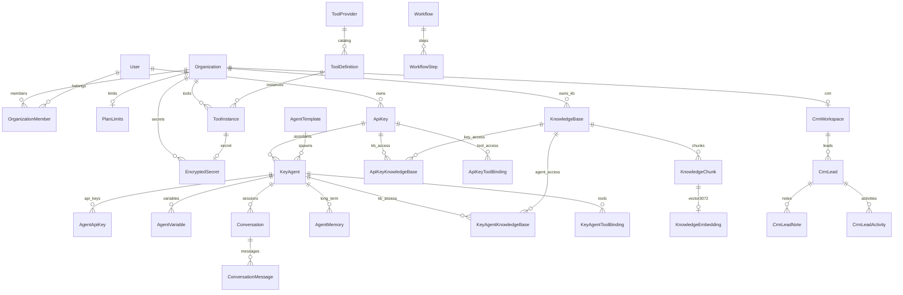

# AI Gateway Platform v2 — Архитектурный проект

**Статус:** SUPERSEDED — заменён на **[ARCHITECTURE_PLAN_v2.3.md](ARCHITECTURE_PLAN_v2.3.md)** (Architecture Freeze)  
**Версия:** 2.2.0-plan (historical)  
**Базовая версия:** v1.0.0 (stable)  
**Дата:** 2026-06-07  
**Ревизия v2.1:** Assistants, Agent Keys, Variables, CRM, Tool Marketplace, MCP  
**Ревизия v2.2:** P0/P1 fixes — multi agt_, Organization, CRM scope, KB ownership, secrets, memory, workflow, embeddings

> **Правило:** реализация кода начинается **только после финального утверждения** v2.2.

---

## Ревизия v2.2 — исправления P0/P1/P2

| Приоритет | Проблема | Решение |
|-----------|----------|---------|
| **P0** | Один `agt_` на ассистента | **N AgentApiKey** per KeyAgent: `name`, `environment`, `@@index([keyAgentId])` |
| **P0** | CRM на ApiKey → две CRM | **CrmWorkspace ∈ Organization**; ApiKey только использует |
| **P0** | Нет Organizations | **`Organization` + `OrganizationMember`** (UI позже) |
| **P1** | KB на ApiKey | **KB ∈ Organization**; ApiKey / Assistant — **доступ** (bindings) |
| **P1** | Секреты в ToolInstance JSON | **`EncryptedSecret`** отдельная таблица |
| **P1** | Нет памяти ассистента | **`Conversation` + `ConversationMessage`** (+ опц. `AgentMemory`) |
| **P1** | Нет Workflow | **`Workflow` + `WorkflowStep`** (schema only, Etap 7) |
| **P1** | `vector(1536)` фиксирован | **`vector(3072)`** + поле `dimensions` + `embeddingModel` |
| **P2** | Нет Agent Marketplace | **`AgentTemplate.isMarketplace`, `isPublic`** |
| **P2** | Нет лимитов тарифа | **`PlanLimits`** на Organization |

### Утверждено без изменений (v2.1)

- ✅ AgentTemplate + KeyAgent  
- ✅ AgentApiKey concept (`agt_`) — **модель расширена в v2.2**  
- ✅ Agent Variables  
- ✅ Tool Marketplace  
- ✅ Internal CRM — **scope изменён на Organization в v2.2**  
- ✅ ApiKey ↔ KB + Assistant ↔ KB — **KB owner → Organization в v2.2**  
- ✅ MCP Ready  
- ✅ Этапы: Agent Builder → Tools → CRM → Knowledge → RAG  

---

## Ревизия v2.1 — что добавлено

| # | Изменение |
|---|-----------|
| 1 | **Терминология:** UI «AI Ассистенты», backend `KeyAgent` |
| 2 | **`AgentType`** на KeyAgent (фильтры, шаблоны, marketplace) |
| 3 | **`AgentApiKey`** (`agt_…`) — отдельный endpoint на ассистента |
| 4 | **`agent_variables`** — шаблонные промпты `{{company_name}}` |
| 5 | **Tool Marketplace:** каталог / мои / подключённые |
| 6 | **Расширенный каталог инструментов** (~60 actions) |
| 7 | **Internal CRM** + **Leads Module** |
| 8 | **ApiKey ↔ KB** + **Assistant ↔ KB** (двухуровневая привязка) |
| 9 | **`tool_providers`** — MCP Ready |
| 10 | **Пересмотренные этапы:** Tools → CRM → Knowledge → RAG |

### Уже утверждено (без изменений)

- ✅ AgentTemplate + KeyAgent  
- ✅ Backward Compatibility (`/v1/agents/…`)  
- ✅ pgvector + BullMQ + Selectel S3 + Parser Integration  
- ✅ Agent Builder First (Этап 1)

---

## Содержание

1. [Терминология и продуктовая модель](#1-терминология-и-продуктовая-модель)
2. [Архитектурный аудит (as-is)](#2-архитектурный-аудит-as-is)
3. [GAP-анализ](#3-gap-анализ)
4. [Целевая концепция (to-be)](#4-целевая-концепция-to-be)
5. [Prisma Schema Design v2.2](#5-prisma-schema-design-v22)
6. [ER-диаграмма](#6-er-диаграмма)
7. [API Contract](#7-api-contract)
8. [UI Sitemap](#8-ui-sitemap)
9. [План миграций БД](#9-план-миграций-бд)
10. [План реализации по этапам](#10-план-реализации-по-этапам)
11. [Risk Analysis](#11-risk-analysis)
12. [Приложения](#12-приложения)

---

## 1. Терминология и продуктовая модель

### 1.1 Публичное vs внутреннее именование

| UI / Docs (RU) | API / Code (EN) | Описание |
|----------------|-----------------|----------|
| **AI Ассистент** | `KeyAgent` | Настраиваемый ассистент на API-ключе |
| **Шаблон ассистента** | `AgentTemplate` | Платформенный preset (Юрист, Продажи…) |
| **API-ключ** | `ApiKey` (`agw_…`) | Основной ключ: биллинг, модели, scope |
| **Ключ ассистента** | `AgentApiKey` (`agt_…`) | Dedicated endpoint; **несколько на ассистента** (prod, test, CRM…) |
| **Организация** | `Organization` | Компания / workspace; CRM, KB, лимиты |
| **База знаний** | `KnowledgeBase` | RAG-хранилище |
| **Инструмент** | `ToolInstance` | Настроенное действие |
| **Каталог инструментов** | `ToolDefinition` | Marketplace catalog |

> В коде и БД **не переименовываем** `KeyAgent` → избегаем массового refactor. В sidebar и заголовках — **«AI Ассистенты»**.

### 1.2 Бизнес-модель

```
Пользователь создаёт API-ключ (agw_…)
    ↓
Создаёт AI Ассистентов (KeyAgent) — Юрист, Продажи, Поддержка
    ↓
Ассистенту можно выдать несколько Agent API Keys (agt_…): Production, Test, CRM, Telegram…
    ↓
Подключает: модели, базы знаний (общие + per-assistant), инструменты
    ↓
Клиенты вызывают:
    POST /v1/assistants/{slug}/chat   Bearer agt_…   ← preferred
    POST /v1/agents/{slug}/chat       Bearer agw_…   ← legacy
```

**Биллинг:** списание всегда с **родительского** `ApiKey` (`agw_`). `AgentApiKey` не имеет отдельного баланса — только scope + analytics.

### 1.3 AgentType

```prisma
enum AgentType {
  ASSISTANT      // Универсальный ассистент
  SALES          // Продажи
  SUPPORT        // Поддержка
  LAWYER         // Юрист
  HR             // HR
  MARKETING      // Маркетинг / копирайт
  DEVELOPER      // Разработчик
  REAL_ESTATE    // Недвижимость
  EDUCATION      // Образование
  CUSTOM         // Пользовательский
}
```

**Зачем:** фильтрация в UI, шаблоны по типу, будущий marketplace, быстрое создание из каталога.

`AgentTemplate.defaultType` → подставляется в `KeyAgent.type` при создании из шаблона.

---

## 2. Архитектурный аудит (as-is)

*(См. v1.0 plan — без изменений по сути.)*

**Критичные gaps для бизнес-модели «AI Assistants via API Keys»:**

| Gap | Impact |
|-----|--------|
| Agent global, не per-key | ❌ Blocker |
| Нет agent-specific API keys | ❌ Blocker |
| Нет variables в промптах | ❌ High |
| Нет Internal CRM для tool output | ❌ Blocker для tools |
| Tool registry без marketplace UX | ⚠️ Medium |
| KB только agent-level (не было key-level) | ⚠️ Medium |
| BullMQ / pgvector / S3 не подключены | ⚠️ Infra |

**Не ломаем:** `POST /v1/chat/completions`, billing 402, KeyModelProfiles, JWT, migrations additive.

---

## 3. GAP-анализ

### 3.1 Новые gaps (v2.1)

| Требование | As-Is | Gap | Этап |
|------------|-------|-----|------|
| UI «AI Ассистенты» | «AI Агенты» cards | Rename + builder | 1 |
| AgentType | ❌ | enum + filter | 1 |
| AgentApiKey `agt_` | ❌ | table + gateway | 1 |
| agent_variables | ❌ | table + prompt render | 1 |
| Tool Marketplace (3 слоя) | ❌ | UI + API | 2 |
| Internal CRM | ❌ | CrmModule | 3 |
| Leads (Lead, Note, Activity) | ❌ | tables + tools | 3 |
| ApiKey ↔ KB default binding | ❌ | junction table | 4 |
| tool_providers MCP | ❌ | provider abstraction | 2 |
| `/v1/assistants/…` endpoint | ❌ | alias + agt auth | 1 |

### 3.2 Приоритетная логика (feedback)

> **Без инструментов ассистент бесполезен. Без CRM инструментам некуда писать.**

Поэтому порядок: **Agent Builder → Tools → CRM → Knowledge → RAG**.

---

## 4. Целевая концепция (to-be)

### 4.1 Иерархия владения (v2.2)

```
Organization                          ← компания / workspace (P0)
 ├── OrganizationMember[]             ← User + role (OWNER, ADMIN, MANAGER, OPERATOR)
 ├── PlanLimits                        ← тарифные квоты (P2)
 ├── CrmWorkspace (one)                ← единая CRM на организацию (P0)
 ├── KnowledgeBase[]                   ← владелец KB — Organization (P1)
 └── (billing via Users' ApiKeys)

User
 ├── OrganizationMember[] → Organization
 └── ApiKey (agw_) — billing, models, rate limits
       ├── KeyAgent[]              ← «AI Ассистенты»
       │     ├── AgentApiKey[]     ← N keys: prod / test / crm / telegram (P0)
       │     ├── AgentVariable[]
       │     ├── Conversation[]    ← session memory (P1)
       │     ├── modelChain[]
       │     ├── knowledgeBindings[]     (доступ к KB)
       │     └── toolBindings[]
       ├── ApiKeyKnowledgeBase[]   ← доступ к KB (не владение)
       ├── ApiKeyToolBinding[]
       └── ToolInstance[]          ← scoped to org + optional apiKey

AgentTemplate (platform, marketplace flags)
ToolDefinition ← ToolProvider (MCP Ready)
Workflow + WorkflowStep (foundation, Etap 7)
EncryptedSecret (tokens, passwords)
```

**Правило разрешения CRM при tool call:**
```
apiKey → user → organization → crmWorkspace (single)
```
Никогда `apiKeyId` как owner CRM.

**Правило разрешения KB:**
```
knowledgeBase.organizationId = user.activeOrganizationId
apiKey grants access via ApiKeyKnowledgeBase / KeyAgentKnowledgeBase
```
Новый ApiKey подключает существующие KB — без переноса данных.

**Personal org:** при регистрации User автоматически получает `Organization` (type=PERSONAL) — UI «организации» можно скрыть до v2.3.

### 4.2 Organization (P0 — schema now, UI later)

```prisma
enum OrganizationType {
  PERSONAL   // auto-created for solo users
  COMPANY
}

enum OrganizationRole {
  OWNER
  ADMIN
  MANAGER
  OPERATOR
}

model Organization {
  id        String           @id @default(cuid())
  type      OrganizationType @default(PERSONAL)
  name      String
  slug      String           @unique
  isActive  Boolean          @default(true) @map("is_active")
  createdAt DateTime         @default(now()) @map("created_at")
  updatedAt DateTime         @updatedAt @map("updated_at")

  members         OrganizationMember[]
  planLimits      PlanLimits?
  crmWorkspace    CrmWorkspace?
  knowledgeBases  KnowledgeBase[]
  toolInstances   ToolInstance[]

  @@map("organizations")
}

model OrganizationMember {
  id             String           @id @default(cuid())
  organizationId String           @map("organization_id")
  userId         String           @map("user_id")
  role           OrganizationRole @default(OPERATOR)
  createdAt      DateTime         @default(now()) @map("created_at")

  organization Organization @relation(...)
  user         User         @relation(...)

  @@unique([organizationId, userId])
  @@index([userId])
  @@map("organization_members")
}
```

`User.activeOrganizationId` — текущий контекст в JWT/panel (default: personal org).

### 4.3 Knowledge Base — владение vs доступ (P1)

```
Organization ──owns──► KnowledgeBase
ApiKey ──access──► ApiKeyKnowledgeBase ──► KnowledgeBase
KeyAgent ──access──► KeyAgentKnowledgeBase ──► KnowledgeBase

RAG effectiveKbIds = union(apiKeyAccess, agentAccess), priority: agent > key
```

### 4.4 Agent API Keys — несколько на ассистента (P0)

```prisma
enum AgentApiKeyEnvironment {
  PRODUCTION
  STAGING
  TEST
  CRM
  TELEGRAM
  CUSTOM
}

model AgentApiKey {
  id           String                 @id @default(cuid())
  keyAgentId   String                 @map("key_agent_id")   // NOT unique
  apiKeyId     String                 @map("api_key_id")     // parent billing
  name         String                 // «Production», «Telegram Bot»
  environment  AgentApiKeyEnvironment @default(PRODUCTION)
  keyHash      String                 @unique @map("key_hash")
  keyPrefix    String                 @map("key_prefix")      // agt_
  keyEncrypted String?                @map("key_encrypted")
  status       ApiKeyStatus           @default(ACTIVE)
  allowedIps   String[]               @default([]) @map("allowed_ips")
  lastUsedAt   DateTime?              @map("last_used_at")
  createdAt    DateTime               @default(now()) @map("created_at")

  keyAgent KeyAgent @relation(fields: [keyAgentId], references: [id], onDelete: Cascade)
  apiKey   ApiKey   @relation(...)

  @@index([keyAgentId])
  @@index([apiKeyId])
  @@map("agent_api_keys")
}
```

**Пример:**
```
Ассистент «Юрист»
  ├── agt_prod_…   (PRODUCTION)
  ├── agt_test_…   (TEST)
  ├── agt_crm_…    (CRM)
  └── agt_tg_…     (TELEGRAM)
```

**Auth:** `Bearer agt_…` → AgentApiKey → KeyAgent → parent ApiKey (billing).

**API (panel):**
- `POST …/assistants/:id/api-keys` — create `{ name, environment }`
- `GET …/assistants/:id/api-keys` — list
- `POST …/assistants/:id/api-keys/:keyId/regenerate`

### 4.5 Agent Variables

```prisma
model AgentVariable {
  id        String  @id @default(cuid())
  agentId   String  @map("agent_id")
  key       String  // company_name, phone, email, website, crm_url
  value     String  @db.Text
  isSecret  Boolean @default(false) @map("is_secret")
  sortOrder Int     @default(0) @map("sort_order")

  agent KeyAgent @relation(...)

  @@unique([agentId, key])
  @@map("agent_variables")
}
```

**Prompt rendering:** перед запросом к LLM:
`systemPrompt.replace(/\{\{(\w+)\}\}/g, (_, k) => variables[k] ?? '')`

Стандартные ключи (seed в UI): `company_name`, `phone`, `email`, `website`, `crm_url`.

### 4.6 Tool Marketplace (3 слоя)

| Слой | UI | Backend |
|------|-----|---------|
| **Каталог** | `/tools/catalog` | `ToolDefinition` + `ToolProvider` (read-only) |
| **Мои инструменты** | `/tools/mine` | `ToolInstance` (configured, scoped to apiKey) |
| **Подключённые** | `/assistants/:id/tools` | `KeyAgentToolBinding` + `ApiKeyToolBinding` |

### 4.7 Tool Providers (MCP Ready)

```prisma
enum ToolProviderType {
  INTERNAL     // built-in executor (CRM, KB search)
  WEBHOOK
  MCP          // Model Context Protocol server
  REST_API
  GRAPHQL
}

model ToolProvider {
  id          String           @id @default(cuid())
  slug        String           @unique
  name        String
  type        ToolProviderType
  configSchema Json            @map("config_schema")
  endpoint    String?          // MCP URL, REST base, etc.
  isActive    Boolean          @default(true) @map("is_active")
  metadata    Json             @default("{}")

  definitions ToolDefinition[]

  @@map("tool_providers")
}
```

`ToolDefinition.providerId` → executor выбирается по типу provider (MCP client, HTTP, internal).

### 4.8 EncryptedSecret (P1)

Секреты **никогда** в plain `ToolInstance.config`.

```prisma
model EncryptedSecret {
  id             String   @id @default(cuid())
  organizationId String   @map("organization_id")
  userId         String   @map("user_id")       // who created
  label          String   // «Telegram Bot Token», «SMTP Password»
  ciphertext     String   @db.Text              // AES-256-GCM
  keyVersion     Int      @default(1) @map("key_version")
  createdAt      DateTime @default(now()) @map("created_at")
  rotatedAt      DateTime? @map("rotated_at")

  organization Organization @relation(...)
  toolInstances ToolInstance[]

  @@index([organizationId])
  @@map("encrypted_secrets")
}
```

`ToolInstance.config` — только non-secret поля (chat_id, from_email).  
`ToolInstance.secretId` → EncryptedSecret (bot token, SMTP password, Bitrix access token).

### 4.9 Internal CRM (P0 — Organization scope)

```prisma
model CrmWorkspace {
  id             String @id @default(cuid())
  organizationId String @unique @map("organization_id")
  name           String @default("CRM")

  organization Organization @relation(...)
  clients      CrmClient[]
  leads        CrmLead[]
  deals        CrmDeal[]
  notes        CrmNote[]
  tasks        CrmTask[]

  @@map("crm_workspaces")
}
```

*(CrmClient, CrmLead, CrmLeadNote, CrmLeadActivity, CrmDeal, CrmNote, CrmTask — без изменений.)*

**Tool resolver:** `apiKey → user → organization → crmWorkspace`.

**UI:** `/crm` — данные **одной** CRM организации; фильтр по `sourceApiKeyId` / `assignedAgentId` опционален.

### 4.10 Agent Memory (P1)

**Session memory (Etap 5.5):**

```prisma
model Conversation {
  id            String   @id @default(cuid())
  organizationId String  @map("organization_id")
  keyAgentId    String   @map("key_agent_id")
  apiKeyId      String   @map("api_key_id")
  agentApiKeyId String?  @map("agent_api_key_id")
  externalId    String?  @map("external_id")   // client-side thread id
  title         String?
  metadata      Json     @default("{}")
  createdAt     DateTime @default(now()) @map("created_at")
  updatedAt     DateTime @updatedAt @map("updated_at")

  keyAgent KeyAgent @relation(...)
  messages ConversationMessage[]

  @@index([keyAgentId, updatedAt])
  @@index([externalId])
  @@map("conversations")
}

model ConversationMessage {
  id             String   @id @default(cuid())
  conversationId String   @map("conversation_id")
  role           String   // system | user | assistant | tool
  content        String   @db.Text
  tokenCount     Int      @default(0) @map("token_count")
  metadata       Json     @default("{}")
  createdAt      DateTime @default(now()) @map("created_at")

  conversation Conversation @relation(...)

  @@index([conversationId, createdAt])
  @@map("conversation_messages")
}
```

**Long-term memory (optional, same etap):**

```prisma
model AgentMemory {
  id         String    @id @default(cuid())
  keyAgentId String    @map("key_agent_id")
  key        String    // fact key
  content    String    @db.Text
  expiresAt  DateTime? @map("expires_at")
  createdAt  DateTime  @default(now()) @map("created_at")

  keyAgent KeyAgent @relation(...)

  @@unique([keyAgentId, key])
  @@map("agent_memories")
}
```

Gateway: если `conversationId` в request → подгрузить history; опционально summarize в AgentMemory.

### 4.11 Workflow Engine — foundation (P1, Etap 7)

Schema only в v2.2; реализация после Tools + CRM.

```prisma
enum WorkflowTriggerType {
  LEAD_CREATED
  TOOL_COMPLETED
  WEBHOOK
  MANUAL
  SCHEDULE
}

enum WorkflowStepType {
  TOOL
  CONDITION
  DELAY
  NOTIFY
}

model Workflow {
  id             String              @id @default(cuid())
  organizationId String              @map("organization_id")
  keyAgentId     String?             @map("key_agent_id")
  name           String
  triggerType    WorkflowTriggerType @map("trigger_type")
  triggerConfig  Json                @default("{}") @map("trigger_config")
  isActive       Boolean             @default(false) @map("is_active")
  createdAt      DateTime            @default(now()) @map("created_at")

  steps WorkflowStep[]

  @@index([organizationId])
  @@map("workflows")
}

model WorkflowStep {
  id         String           @id @default(cuid())
  workflowId String           @map("workflow_id")
  order      Int
  type       WorkflowStepType
  config     Json             @default("{}")

  workflow Workflow @relation(...)

  @@unique([workflowId, order])
  @@map("workflow_steps")
}
```

**Пример (будущее):** Lead created → create client → Telegram notify → create task.

### 4.12 Embeddings — dimension strategy (P1)

**Не использовать `vector(1536)` как единственный формат.**

```prisma
model KnowledgeEmbedding {
  id           String @id @default(cuid())
  chunkId      String @unique @map("chunk_id")
  model        String   // openai/text-embedding-3-large
  dimensions   Int      // фактическая размерность: 768, 1024, 1536, 3072
  // SQL migration:
  embedding    Unsupported("vector(3072)")  // max bucket; slice by dimensions

  chunk KnowledgeChunk @relation(...)

  @@index([chunkId])
  @@map("knowledge_embeddings")
}
```

**Правила:**
- `KnowledgeBase.settings.embeddingModel` + `dimensions` — per KB
- Search только внутри KB с **одинаковой** model+dimension (или reindex job при смене)
- Поддерживаемые размерности: 768 (BGE/Nomic), 1024 (Voyage), 1536 (OpenAI small), 3072 (OpenAI large)
- Cosine distance через pgvector; неиспользуемые компоненты вектора = 0

### 4.13 AgentTemplate Marketplace (P2)

```prisma
model AgentTemplate {
  // ... existing fields ...
  isPublic       Boolean @default(false) @map("is_public")
  isMarketplace  Boolean @default(false) @map("is_marketplace")
  authorOrgId    String? @map("author_org_id")
  installCount   Int     @default(0) @map("install_count")
}
```

### 4.14 PlanLimits (P2)

```prisma
model PlanLimits {
  id             String @id @default(cuid())
  organizationId String @unique @map("organization_id")
  planName       String @default("free") @map("plan_name")
  maxApiKeys           Int @default(3) @map("max_api_keys")
  maxAssistants        Int @default(10) @map("max_assistants")
  maxAgentApiKeys      Int @default(20) @map("max_agent_api_keys")
  maxKnowledgeBases    Int @default(5) @map("max_knowledge_bases")
  maxDocuments         Int @default(1000) @map("max_documents")
  maxChunks            Int @default(100000) @map("max_chunks")
  maxToolInstances     Int @default(20) @map("max_tool_instances")
  maxStorageMb         Int @default(5120) @map("max_storage_mb")

  organization Organization @relation(...)

  @@map("plan_limits")
}
```

Enforcement в services перед create; admin override для platform ADMIN.

### 4.15 NestJS Modules (to-be)

```
organizations/     Organization, members, PlanLimits
agent-builder/     KeyAgent, AgentApiKey[], variables, templates
memory/            Conversation, ConversationMessage, AgentMemory
tools/             ToolRegistry, EncryptedSecret, MCP
crm/               CrmWorkspace (org-scoped)
knowledge/         KB (org-owned), ingestion, search
workflows/         Workflow schema (Etap 7)
storage/           Selectel S3
parser/            HTTP client
workers/           BullMQ processors
```

### 4.16 Backward compatibility

| Legacy | v2.2 |
|--------|------|
| `POST /v1/agents/:slug/chat` + `agw_` | ✅ Сохраняем |
| `POST /v1/assistants/:slug/chat` + `agt_` | ✅ Новый preferred |
| Global seed agents | → `AgentTemplate`, fallback в gateway |
| `AgentTool` stub | → migrate to bindings |

---

## 5. Prisma Schema Design v2.2

### 5.1 Enums (consolidated)

```prisma
enum AgentType {
  ASSISTANT SALES SUPPORT LAWYER HR MARKETING
  DEVELOPER REAL_ESTATE EDUCATION CUSTOM
}

enum AgentApiKeyEnvironment {
  PRODUCTION STAGING TEST CRM TELEGRAM CUSTOM
}

enum OrganizationType { PERSONAL COMPANY }
enum OrganizationRole { OWNER ADMIN MANAGER OPERATOR }

enum KnowledgeSourceType { TEXT PDF DOCX TXT MARKDOWN CSV EXCEL ZIP URL SITEMAP }
enum KnowledgeJobStatus { PENDING QUEUED PROCESSING COMPLETED FAILED CANCELLED }
enum KnowledgeJobType { INGEST PARSE CHUNK EMBED TAXONOMY REINDEX EXPORT OCR RESCAN }
enum ToolProviderType { INTERNAL WEBHOOK MCP REST_API GRAPHQL }
enum ToolCategory { COMMUNICATION CRM DOCUMENTS CALENDAR AI KNOWLEDGE FILES INTEGRATION CUSTOM }
enum CrmLeadStatus { NEW CONTACTED QUALIFIED PROPOSAL WON LOST }
enum CrmDealStage { NEW QUALIFICATION PROPOSAL NEGOTIATION WON LOST }
enum SearchMode { SEMANTIC FULLTEXT HYBRID }
enum ToolExecutionStatus { SUCCESS ERROR TIMEOUT RATE_LIMITED }
enum WorkflowTriggerType { LEAD_CREATED TOOL_COMPLETED WEBHOOK MANUAL SCHEDULE }
enum WorkflowStepType { TOOL CONDITION DELAY NOTIFY }
```

### 5.2 KnowledgeBase (org-owned)

```prisma
model KnowledgeBase {
  id             String   @id @default(cuid())
  organizationId String   @map("organization_id")
  userId         String   @map("user_id")   // creator
  name           String
  slug           String
  description    String?
  settings       Json     @default("{}")   // embeddingModel, dimensions, chunkSize
  isActive       Boolean  @default(true) @map("is_active")
  stats          Json     @default("{}")
  createdAt      DateTime @default(now()) @map("created_at")
  updatedAt      DateTime @updatedAt @map("updated_at")

  organization   Organization @relation(...)
  apiKeyAccess   ApiKeyKnowledgeBase[]
  agentAccess    KeyAgentKnowledgeBase[]
  // ... documents, chunks, jobs (as v2.1)

  @@unique([organizationId, slug])
  @@index([organizationId])
  @@map("knowledge_bases")
}
```

### 5.3 KeyAgent (extended)

```prisma
model KeyAgent {
  // ... fields as v2.1 ...
  agentApiKeys   AgentApiKey[]      // plural — N keys per assistant
  conversations  Conversation[]
  agentMemories  AgentMemory[]
  // remove: agentApiKey AgentApiKey? @unique

  @@unique([apiKeyId, slug])
  @@index([apiKeyId, type])
  @@map("key_agents")
}
```

### 5.4 ToolInstance (with EncryptedSecret)

```prisma
model ToolInstance {
  id             String   @id @default(cuid())
  toolId         String   @map("tool_id")
  organizationId String   @map("organization_id")
  apiKeyId       String?  @map("api_key_id")
  userId         String   @map("user_id")
  name           String
  config         Json     @default("{}")   // non-secret only
  secretId       String?  @map("secret_id")
  isActive       Boolean  @default(true) @map("is_active")
  createdAt      DateTime @default(now()) @map("created_at")
  updatedAt      DateTime @updatedAt @map("updated_at")

  tool         ToolDefinition @relation(...)
  organization Organization   @relation(...)
  secret       EncryptedSecret? @relation(...)
  apiKey       ApiKey?        @relation(...)

  @@index([organizationId])
  @@index([apiKeyId])
  @@map("tool_instances")
}
```

### 5.5 ApiKey ↔ KnowledgeBase (access, not ownership)

```prisma
model ApiKeyKnowledgeBase {
  apiKeyId        String @map("api_key_id")
  knowledgeBaseId String @map("knowledge_base_id")
  isDefault       Boolean @default(true) @map("is_default")
  priority        Int    @default(0)

  apiKey        ApiKey        @relation(...)
  knowledgeBase KnowledgeBase @relation(...)

  @@id([apiKeyId, knowledgeBaseId])
  @@map("api_key_knowledge_bases")
}
```

### 5.6 ToolDefinition, Usage, Audit

*(ToolDefinition, UsageLog extensions, AuditAction — as v2.1 + conversationId, workflow events.)*

**UsageLog additions:**
```prisma
keyAgentId       String?
agentApiKeyId    String?
conversationId   String?
knowledgeBaseId  String?
toolExecutionId  String?
crmLeadId        String?
ragChunksUsed    Int @default(0)
organizationId   String?  // denormalized for analytics
```

**AuditAction additions:**
```
ASSISTANT_CREATED / _UPDATED / _DELETED
ASSISTANT_API_KEY_CREATED / _REGENERATED
ASSISTANT_VARIABLE_UPDATED
CRM_LEAD_CREATED / _UPDATED
CRM_CLIENT_CREATED
TOOL_PROVIDER_ADDED
KB_BOUND_TO_API_KEY / KB_BOUND_TO_ASSISTANT
MCP_TOOL_EXECUTED
```

---

## 6. ER-диаграмма



---

## 7. API Contract

### 7.1 Assistants (Agent Builder)

| Method | Path | Auth | Description |
|--------|------|------|-------------|
| GET | `/agent-templates?type=` | JWT | Шаблоны по AgentType |
| GET | `/api-keys/:keyId/assistants` | JWT | List KeyAgents |
| POST | `/api-keys/:keyId/assistants` | JWT | Create `{ type, templateId?, name, slug, … }` |
| GET | `/api-keys/:keyId/assistants/:id` | JWT | Full config |
| PUT | `/api-keys/:keyId/assistants/:id` | JWT | Update + revision |
| DELETE | `/api-keys/:keyId/assistants/:id` | JWT | Delete |
| GET/PUT | `…/assistants/:id/variables` | JWT | Agent variables CRUD |
| GET | `…/assistants/:id/api-keys` | JWT | List all agt_ keys |
| POST | `…/assistants/:id/api-keys` | JWT | Create `{ name, environment }` |
| POST | `…/assistants/:id/api-keys/:keyId/regenerate` | JWT | Rotate one key |
| DELETE | `…/assistants/:id/api-keys/:keyId` | JWT | Revoke |
| PUT | `…/assistants/:id/models` | JWT | Model chain |
| PUT | `…/assistants/:id/knowledge-bases` | JWT | Assistant KB bindings |
| PUT | `…/assistants/:id/tools` | JWT | Assistant tool bindings |

**Runtime — preferred:**
| Method | Path | Auth |
|--------|------|------|
| GET | `/v1/assistants` | `agt_` or `agw_` |
| GET | `/v1/assistants/:slug` | `agt_` or `agw_` |
| POST | `/v1/assistants/:slug/chat` | **`agt_` preferred**; `agw_` + slug |

**Runtime — legacy (compat):**
| POST | `/v1/agents/:slug/chat` | `agw_` |

### 7.2 Knowledge Base

| POST | `/knowledge-bases` | JWT | Create `{ organizationId, name, slug }` — **not** apiKeyId |
| PUT | `/api-keys/:keyId/knowledge-bases` | JWT | Grant/revoke KB **access** |
| GET | `/knowledge-bases?organizationId=` | JWT | List org KBs |
| … | *(tabs API as v2.1)* | | |

### 7.3 Organizations (schema now, minimal API)

| GET | `/organizations/current` | JWT | Active org + role |
| GET | `/organizations/:id/members` | JWT | Members (OWNER/ADMIN) |
| POST | `/organizations` | JWT | Create company org |

### 7.4 Tool Marketplace

| GET | `/tools/catalog` | JWT | All ToolDefinitions by category |
| GET | `/tools/catalog/:slug` | JWT | Detail + provider info |
| GET | `/tools/mine?apiKeyId=` | JWT | ToolInstances |
| POST | `/tools/mine` | JWT | Create instance from catalog |
| GET | `/tools/connected?apiKeyId=` | JWT | ApiKeyToolBinding + agent bindings |
| PUT | `/api-keys/:keyId/tools` | JWT | Connect/disconnect at key level |
| POST | `/tools/mine/:id/test` | JWT | Test (uses EncryptedSecret) |

| POST | `/v1/knowledge/search` | Key | RAG search |

### 7.5 Internal CRM (Organization scope)

| GET/POST | `/crm/clients` | JWT | Scoped to `organizationId` from JWT |
| GET/POST | `/crm/leads` | JWT | + optional filter `sourceApiKeyId` |
| … | *(notes, deals, tasks as v2.1)* | | |

**Tool resolver:** always `organization.crmWorkspace`, never per-apiKey.

### 7.6 Memory (Etap 5.5)

| GET/POST | `/assistants/:id/conversations` | JWT | Session list |
| GET | `/conversations/:id/messages` | JWT | History |
| POST | `/v1/assistants/:slug/chat` | agt_/agw_ | Optional `{ conversationId, externalId }` |

### 7.7 Workflows (Etap 7 — schema early)

| GET/POST | `/workflows?organizationId=` | JWT | CRUD |
| PUT | `/workflows/:id/steps` | JWT | Step chain |

### 7.8 Analytics (extended)

| GET | `/analytics/assistants?apiKeyId=` | JWT |
| GET | `/analytics/tools?apiKeyId=` | JWT |
| GET | `/analytics/knowledge?apiKeyId=` | JWT |
| GET | `/analytics/crm/leads?apiKeyId=` | JWT |

---

## 8. UI Sitemap

### 8.1 Sidebar

```
MAIN
  Dashboard                     /
  API Ключи                     /keys
  API Ключ (hub)                /keys/:id
  Модели для ключей             /key-models
  Каталог OpenRouter            /models
  AI Ассистенты                 /assistants          ★ renamed
  Базы знаний                   /knowledge
  Инструменты                   /tools
  CRM                           /crm                   ★ NEW
  Аналитика                     /analytics
  Документация                  /docs
  Настройки                     /settings
```

> Route `/agents` → redirect `/assistants` (301 in router).

### 8.2 AI Ассистенты

```
/assistants                       List (filter: apiKey, AgentType)
/assistants/create                Full page: key → type → template
/assistants/:id                   Tabs (no modal):
  ├── general       name, slug, type, avatar, prompts, variables
  ├── models        drag-drop chain
  ├── knowledge     key defaults + assistant overrides
  ├── tools         connected tools
  ├── api-keys       list/create agt_ keys (prod, test, crm…)
  ├── analytics
  └── history       revisions
```

### 8.3 Tool Marketplace

```
/tools                            Landing: 3 cards → catalog / mine / connected
/tools/catalog                    Grid by category (CRM, Communication, AI…)
/tools/catalog/:slug              Tool detail + «Добавить в мои»
/tools/mine?apiKeyId=             Configured instances
/tools/mine/:id                   Full page settings (NOT popup)
/tools/:slug                      Shortcut → catalog/:slug
/tools/connected?apiKeyId=        Key + assistant bindings overview
/tools/providers                  MCP / REST providers (admin)
/tools/providers/:slug            Provider config page
```

### 8.4 CRM

```
/crm                              Overview dashboard
/crm/clients                      Client list + /crm/clients/:id
/crm/leads                        Lead pipeline + /crm/leads/:id
/crm/deals                        Deal board
/crm/tasks                        Task list
/crm/notes                        Notes search
```

### 8.5 Knowledge + API Key hub

*(As v2.0 + tab «Общие БЗ» on `/keys/:id/knowledge`)*

---

## 9. План миграций БД

### M0 — Organization foundation (P0, first)
```
organizations + organization_members
plan_limits (defaults)
auto-create PERSONAL org on user signup (seed script)
user.active_organization_id
```

### M1 — Assistants
```
enable_pgvector
agent_templates (+ isPublic, isMarketplace)
key_agents (+ AgentType)
agent_api_keys (N per assistant, NO unique on keyAgentId)
agent_variables
key_agent_model_chains
migrate_seed_agents_to_templates
```

### M2 — Tools + Secrets
```
tool_providers
tool_definitions (full seed)
encrypted_secrets
tool_instances (organizationId, secretId)
api_key_tool_bindings + key_agent_tool_bindings
tool_execution_logs
```

### M3 — CRM (Organization scope)
```
crm_workspaces (organizationId UNIQUE, drop apiKeyId if existed)
crm_clients, crm_leads, crm_lead_notes, crm_lead_activities
crm_deals, crm_notes, crm_tasks
```

### M4 — Knowledge (Organization owned)
```
knowledge_bases (organizationId, NOT apiKeyId)
api_key_knowledge_bases (access)
key_agent_knowledge_bases
knowledge_sources, documents, categories, tags, chunks
knowledge_embeddings (vector(3072), dimensions int)
knowledge_jobs, search_logs
```

### M5 — Memory + Usage
```
conversations + conversation_messages
agent_memories (optional)
usage_logs v2 columns + organizationId
audit_action enum extend
key_agent_revisions
```

### M6 — Workflow foundation (schema only)
```
workflows + workflow_steps
```

### M7 — Legacy deprecation (v2.2+)
```
agents → view alias
drop agent_tools
```

---

## 10. План реализации по этапам

### Этап 0 — Foundation (1 неделя)

- [ ] Утверждение ARCHITECTURE_PLAN **v2.2**
- [ ] Branch `feature/v2-platform`
- [ ] **M0:** Organization + PlanLimits + personal org seed
- [ ] pgvector in docker-compose.prod.yml
- [ ] BullMQ + Redis wiring
- [ ] ENV: S3, Parser, `SECRET_ENCRYPTION_KEY`, feature flags
- [ ] Terminology: «AI Ассистенты», `/assistants`

### Этап 1 — Agent Builder (2–3 недели) ★ FIRST

- [ ] **M1** migrations
- [ ] AgentBuilderModule: KeyAgent, **N× AgentApiKey**, AgentType, variables
- [ ] Gateway: `/v1/assistants/:slug/chat` + multi agt_ auth
- [ ] Legacy `/v1/agents/…`
- [ ] UI: /assistants, create, tabs (general, models, variables, **api-keys list**)
- [ ] PlanLimits enforcement (maxAssistants, maxAgentApiKeys)
- [ ] Audit + analytics per assistant

**Deliverable:** Org → API key → assistants → multiple agt_ per assistant.

### Этап 2 — Tool Registry Core (2–3 недели)

- [ ] **M2** migrations
- [ ] EncryptedSecret service
- [ ] Tool Marketplace UI (catalog / mine / connected)
- [ ] ToolInstance CRUD + full-page settings
- [ ] Internal executors: webhook, http-request
- [ ] ApiKey + KeyAgent tool bindings
- [ ] MCP provider interface (stub)

**Deliverable:** Connect webhook tool; secrets in EncryptedSecret.

### Этап 3 — Internal CRM (2 недели)

- [ ] **M3** migrations — **org-scoped CRM**
- [ ] CrmModule + UI `/crm/*`
- [ ] CRM tool executors → single org workspace
- [ ] Leads pipeline; `sourceApiKeyId` / `assignedAgentId` metadata

**Deliverable:** «Создать лид» → org CRM (shared across all api keys).

### Этап 4 — Knowledge Base (3–4 недели)

- [ ] **M4** migrations — KB **org-owned**, apiKey **access**
- [ ] StorageModule Selectel S3
- [ ] Upload, ingest, Parser client
- [ ] UI: /knowledge/* ; connect KB to new apiKey without migration

**Deliverable:** Shared KB across keys of same organization.

### Этап 5 — RAG (2–3 недели)

- [ ] Embeddings worker; **vector(3072)** + dimensions
- [ ] Hybrid / semantic / FTS search
- [ ] Gateway RAG in assistant chat
- [ ] KB tools: search, reindex, rescan

**Deliverable:** Assistant answers with KB context.

### Этап 5.5 — Memory (1–2 недели)

- [ ] **M5** conversation tables
- [ ] `conversationId` / `externalId` in chat API
- [ ] UI: conversation history per assistant
- [ ] Optional AgentMemory summarization

**Deliverable:** Multi-turn sessions without client-side history.

### Этап 6 — External Integrations (ongoing)

- [ ] MCP full client
- [ ] Telegram, Email, SMS, Bitrix24, AmoCRM
- [ ] Function-calling orchestration loop
- [ ] AgentTemplate marketplace UI (`isMarketplace`)

### Этап 7 — Workflow Engine (2–3 недели)

- [ ] **M6** workflows schema (if not in M5)
- [ ] BullMQ workflow runner
- [ ] Triggers: LEAD_CREATED, TOOL_COMPLETED
- [ ] UI: `/workflows` builder (full pages)

**Deliverable:** Lead → client → Telegram → task automation.

### Этап 8 — Scale & Hardening

- [ ] usage_logs partitioning
- [ ] Load tests: 100K assistants, 1M docs, 10M chunks
- [ ] Read replicas, DLQ, monitoring
- [ ] Drop legacy `agents` (v3.0)

### Timeline

| Этап | Weeks | Cumulative |
|------|-------|------------|
| 0 Foundation + Org | 1 | 1 |
| 1 Agent Builder | 2–3 | 3–4 |
| 2 Tools | 2–3 | 5–7 |
| 3 CRM | 2 | 7–9 |
| 4 Knowledge | 3–4 | 10–13 |
| 5 RAG | 2–3 | 12–16 |
| 5.5 Memory | 1–2 | 13–18 |
| 6 Integrations | ongoing | — |
| 7 Workflow | 2–3 | — |
| 8 Scale | ongoing | — |

**MVP (Этапы 0–3):** ~7–9 недель — assistants + tools + org CRM.

---

## 11. Risk Analysis

| # | Risk | Mitigation |
|---|------|------------|
| R1 | Two key types (`agw_`/`agt_`) confuse integrators | Docs; agt shows parent key; multiple agt named by environment |
| R2 | Billing leak via agt_ | agt → parent ApiKey balance |
| R3 | **Duplicate CRM per apiKey** | **CrmWorkspace ∈ Organization only** (P0 fix) |
| R4 | **KB trapped on apiKey** | **KB ∈ Organization**; apiKey access bindings (P1 fix) |
| R5 | **Secrets in JSON** | **EncryptedSecret** table + rotation (P1 fix) |
| R6 | CRM multi-tenant leak | All CRM `WHERE workspace.organizationId = :org` |
| R7 | MCP security | Admin-approved providers; org allowlist |
| R8 | Embedding dimension lock-in | **vector(3072)** + dimensions field (P1 fix) |
| R9 | No conversation memory | Conversation model Etap 5.5 |
| R10 | Workflow scope creep | Schema in M6; runner Etap 7 only |
| R11 | PlanLimits bypass | Enforce in create services; admin override logged |
| R12 | Legacy `/agents` breaks | Dual routes + deprecation headers |
| R13 | Personal org confusion | Hide org UI until COMPANY needed; personal org transparent |

---

## 12. Приложения

### 12.1 Tool Catalog (full seed)

#### CRM
| slug | name |
|------|------|
| crm-create-client | Создать клиента |
| crm-update-client | Обновить клиента |
| crm-create-lead | Создать лид |
| crm-update-lead | Обновить лид |
| crm-create-deal | Создать сделку |
| crm-create-contact | Создать контакт |
| crm-update-status | Изменить статус |
| crm-create-note | Создать заметку |
| crm-update-note | Изменить заметку |
| crm-delete-note | Удалить заметку |
| crm-create-task | Создать задачу |
| crm-create-reminder | Напоминание |
| crm-create-event | Событие календаря |
| crm-update-event | Изменить событие |
| crm-booking | Бронирование |

#### Communication
| slug | name |
|------|------|
| telegram-send | Telegram |
| max-send | MAX |
| email-send | Email |
| sms-send | SMS |
| webhook-call | Webhook |
| push-send | Push уведомление |

#### Knowledge / AI
| slug | name |
|------|------|
| knowledge-search | Поиск по БЗ |
| rag-search | RAG Search |
| kb-rescan | Пересканирование |
| kb-reindex | Переиндексация |
| web-search | Web Search |
| deep-research | Deep Research |
| ocr-extract | OCR |
| vision-analyze | Vision |
| parser-fetch | Parser (URL) |

#### Files / Documents
| slug | name |
|------|------|
| doc-create-pdf | Создать PDF |
| doc-create-docx | Создать DOCX |
| doc-create | Создать документ |
| doc-create-contract | Создать договор |
| doc-sign | Подписать документ |
| doc-send | Отправить документ |
| file-save | Сохранить файл |
| file-send | Отправить файл |

#### Integrations
| slug | name |
|------|------|
| bitrix24 | Bitrix24 |
| amocrm | AmoCRM |
| google-api | Google |
| openrouter | OpenRouter |
| openai | OpenAI |
| selectel-s3 | Selectel S3 |

### 12.2 AgentTemplate ↔ AgentType mapping

| Template | AgentType |
|----------|-----------|
| Юрист | LAWYER |
| Маркетолог / Копирайтер | MARKETING |
| Разработчик | DEVELOPER |
| Поддержка | SUPPORT |
| HR | HR |
| Продажи | SALES |
| Недвижимость | REAL_ESTATE |
| Образование | EDUCATION |
| Универсальный | ASSISTANT |
| Пользовательский | CUSTOM |

### 12.3 ENV (без секретов)

```env
# S3 Selectel — credentials ONLY on server .env
S3_ENDPOINT=https://s3.ru-3.storage.selcloud.ru
S3_REGION=ru-3
S3_ACCESS_KEY=
S3_SECRET_KEY=
S3_BUCKET_RAW=knowledge-raw
S3_BUCKET_PROCESSED=knowledge-processed
S3_BUCKET_OCR=knowledge-ocr
S3_BUCKET_CHUNKS=knowledge-chunks
S3_BUCKET_EXPORTS=knowledge-exports

# Knowledge / Agent
AGENT_KEY_PREFIX=agt_
SECRET_ENCRYPTION_KEY=           # AES for EncryptedSecret

# Embeddings
KNOWLEDGE_EMBEDDING_MAX_DIMENSIONS=3072

# MCP
MCP_ENABLED=false
MCP_DEFAULT_TIMEOUT_MS=30000

# Feature flags
FF_ASSISTANTS=true
FF_TOOLS=false
FF_CRM=false
FF_KNOWLEDGE=false
```

### 12.4 Final approval checklist (v2.2)

**Approved (v2.1, unchanged intent):**
- [x] AgentTemplate + KeyAgent
- [x] AgentApiKey (`agt_`) — **v2.2: multiple per assistant**
- [x] Agent Variables
- [x] Tool Marketplace
- [x] Internal CRM — **v2.2: Organization scope**
- [x] ApiKey ↔ KB + Assistant ↔ KB — **v2.2: KB org-owned**
- [x] MCP Ready
- [x] Этапы: Agent Builder → Tools → CRM → Knowledge → RAG

**v2.2 additions (confirm for «утверждаю v2.2»):**
- [ ] Organization + OrganizationMember (P0)
- [ ] N× AgentApiKey with `name`, `environment` (P0)
- [ ] CrmWorkspace on Organization, not ApiKey (P0)
- [ ] KnowledgeBase on Organization + access bindings (P1)
- [ ] EncryptedSecret for tool tokens (P1)
- [ ] Conversation + ConversationMessage (P1, Etap 5.5)
- [ ] Workflow + WorkflowStep schema (P1, Etap 7)
- [ ] vector(3072) + dimensions (P1)
- [ ] AgentTemplate marketplace flags (P2)
- [ ] PlanLimits (P2)
- [ ] Revised roadmap: +5.5 Memory, +7 Workflow, 8 Scale

---

**Следующий шаг:** «утверждаю v2.2» → Этап 0 (Organization + Foundation) → Этап 1.
